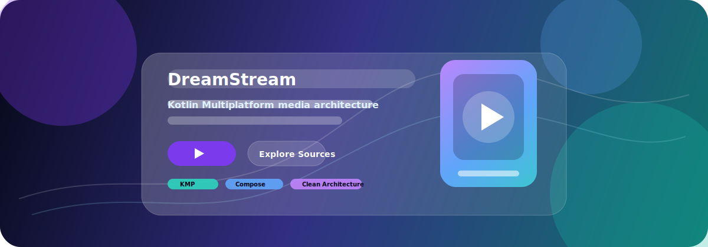

<div align="center">

# DreamStream

**A native-first Kotlin Multiplatform media experience built for discovery, playback, and long-term modular growth.**

[](https://github.com/Act-Aks/dreamstream/actions/workflows/ci.yml)
[](LICENSE)
[](gradle/libs.versions.toml)
[](gradle/libs.versions.toml)
[](gradle/wrapper/gradle-wrapper.properties)
[](#targets)

<br />



<br />

<table>
  <tr>
    <td><strong>Native UI</strong><br />Compose-first, polished, responsive interfaces.</td>
    <td><strong>Modular Core</strong><br />Feature-layered KMP architecture with strict boundaries.</td>
    <td><strong>Privacy First</strong><br />No telemetry or sensitive logging without explicit design.</td>
  </tr>
  <tr>
    <td><strong>Typed Failures</strong><br />Expected failures flow through Result and domain errors.</td>
    <td><strong>Source Safe</strong><br />Provider details stay isolated in data-layer implementations.</td>
    <td><strong>Production Ready</strong><br />CI, Dependabot, issue forms, security policy, and contribution docs.</td>
  </tr>
</table>

</div>

## Status

DreamStream is in early scaffold development. The repository currently contains the build infrastructure, convention plugins, version catalog, foundational `core` modules, community files, and CI setup. Feature modules and the `:app` shell are intentionally not created until there is real product code to justify them.

## Vision

DreamStream is a modern Kotlin Multiplatform multimedia app for discovering and streaming entertainment content through a native, polished, ad-free interface.

The project is designed as a long-lived modular application that can support multiple content sources, rich discovery, playback, offline-aware flows, and high-quality Android-first Compose UI while remaining portable to future KMP targets.

## Project Snapshot

| Area | Current Choice |
| --- | --- |
| Language | Kotlin 2.3.21 Multiplatform |
| UI | Compose Multiplatform 1.11.0, Material 3 |
| Build | Gradle Kotlin DSL, AGP 9.2.1, JDK 17 toolchain |
| Architecture | Feature-layered Clean Architecture |
| Presentation | MVI with `State`, `Action`, `Event`, `StateFlow`, and one-time event `Flow` |
| Dependency injection | Koin |
| Networking | Ktor Client |
| Serialization | KotlinX Serialization |
| Local data | Room, DataStore |
| Navigation | Type-safe Compose Navigation |
| Media | Media3 planned for Android playback abstractions |
| Testing | JUnit5, AssertK, Turbine, kotlinx-coroutines-test, Compose UI Test |
| Quality | Detekt, CI, Dependabot, EditorConfig |

## Targets

| Target | Status | Notes |
| --- | --- | --- |
| Android | Primary | `minSdk = 26`, `compileSdk = 37`, `targetSdk = 37` |
| Desktop JVM | Foundation ready | Compose Multiplatform with JDK 17 |

## Architecture At A Glance

```text
presentation -> domain <- data
```

DreamStream uses feature-layered modularization. Code lives in a feature module unless it is genuinely shared; shared contracts and utilities live in the right `core` module. Domain modules stay pure Kotlin and never import Android, Compose, Room, Ktor, or DI frameworks.

```text
DreamStream/
|-- build-logic/                  Convention plugins
|   `-- convention/
|-- core/
|   |-- domain/                   Result<T, E>, Error, DataError, result helpers
|   |-- presentation/             UiText, ObserveAsEvents, error-to-UiText mapping
|   `-- design-system/            Theme, color, typography, shape
|-- gradle/
|   `-- libs.versions.toml        Dependency and plugin versions
|-- settings.gradle.kts
`-- build.gradle.kts
```

Planned modules are added only when implementation needs them:

```text
:app
:core:data
:core:media
:feature:<name>:domain
:feature:<name>:data
:feature:<name>:presentation
```

## Guardrails

| Principle | What it means |
| --- | --- |
| Clean boundaries | `presentation -> domain <- data`; features do not depend on each other directly. |
| Typed errors | Expected failures use `Result<D, E : Error>` instead of exceptions. |
| Isolated sources | Provider DTOs, parsers, headers, URLs, and quirks stay inside data-layer source implementations. |
| Privacy by default | Tokens, cookies, private URLs, playback history, and PII are not logged or committed. |
| No speculative modules | Empty modules are not created for hypothetical future features. |
| Legal source rules | No DRM circumvention, paywall bypassing, credential theft, token scraping, ad rendering, tracker preservation, or access-control evasion. |

See [`AGENTS.md`](AGENTS.md) for the full architectural contract.

## Quick Start

### Prerequisites

- JDK 17
- Android Studio Ladybug or newer for Android development
- Git

### Clone

```bash
git clone https://github.com/Act-Aks/dreamstream.git DreamStream
cd DreamStream
```

### Build And Verify

```bash
./gradlew build
./gradlew check detekt
```

### Focused Commands

```bash
./gradlew :core:domain:allTests
./gradlew :core:domain:detekt
```

## Build System

All shared Gradle configuration lives in [`build-logic/convention`](build-logic/convention). Module build files stay small and declarative.

| Rule | Location |
| --- | --- |
| Dependency and plugin versions | [`gradle/libs.versions.toml`](gradle/libs.versions.toml) |
| Convention plugins | [`build-logic/convention`](build-logic/convention) |
| Detekt config | [`config/detekt/detekt.yml`](config/detekt/detekt.yml) |
| CI workflow | [`.github/workflows/ci.yml`](.github/workflows/ci.yml) |
| Dependency updates | [`.github/dependabot.yml`](.github/dependabot.yml) |

## Testing Strategy

- Every ViewModel should have unit tests.
- Fakes are preferred over mocks for repositories and data sources.
- ViewModel tests use `Dispatchers.setMain(UnconfinedTestDispatcher())` and Turbine.
- Critical user flows should have Compose UI tests.
- Non-trivial parser, database, repository, and source behavior should have integration tests.

See [`.opencode/skills/android-testing/SKILL.md`](.opencode/skills/android-testing/SKILL.md) for the full testing playbook.

## Contributing

Start here:

| Document | Purpose |
| --- | --- |
| [`CONTRIBUTING.md`](CONTRIBUTING.md) | Setup, workflow, architecture summary, and PR checklist |
| [`AGENTS.md`](AGENTS.md) | Product direction, non-negotiable principles, and module rules |
| [`.opencode/skills/`](.opencode/skills) | Implementation playbooks for each layer |
| [`CODE_OF_CONDUCT.md`](CODE_OF_CONDUCT.md) | Community expectations and enforcement process |
| [`SECURITY.md`](SECURITY.md) | Private vulnerability reporting process |

Issues and pull requests should use the templates in [`.github`](.github). Do not open public issues for security vulnerabilities or Code of Conduct incidents.

DreamStream uses Conventional Commits with feature or layer scopes:

```text
feat(core-domain): add Result and Error types
build(convention): refine convention plugins and version catalog
fix(search): handle empty provider responses
```

## License

DreamStream is licensed under the [Apache License 2.0](LICENSE).

Copyright 2026 DreamStream Contributors.
