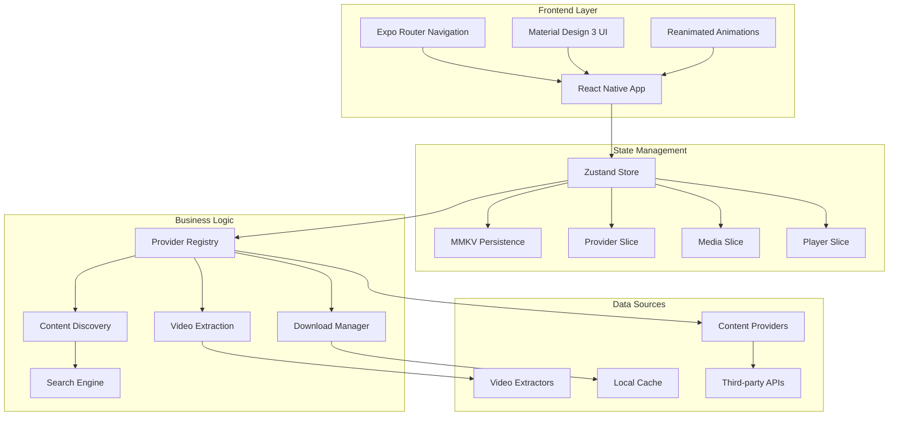
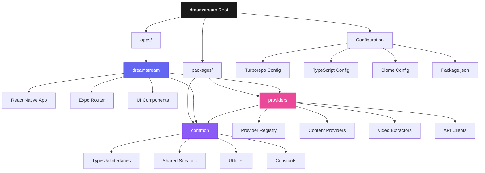
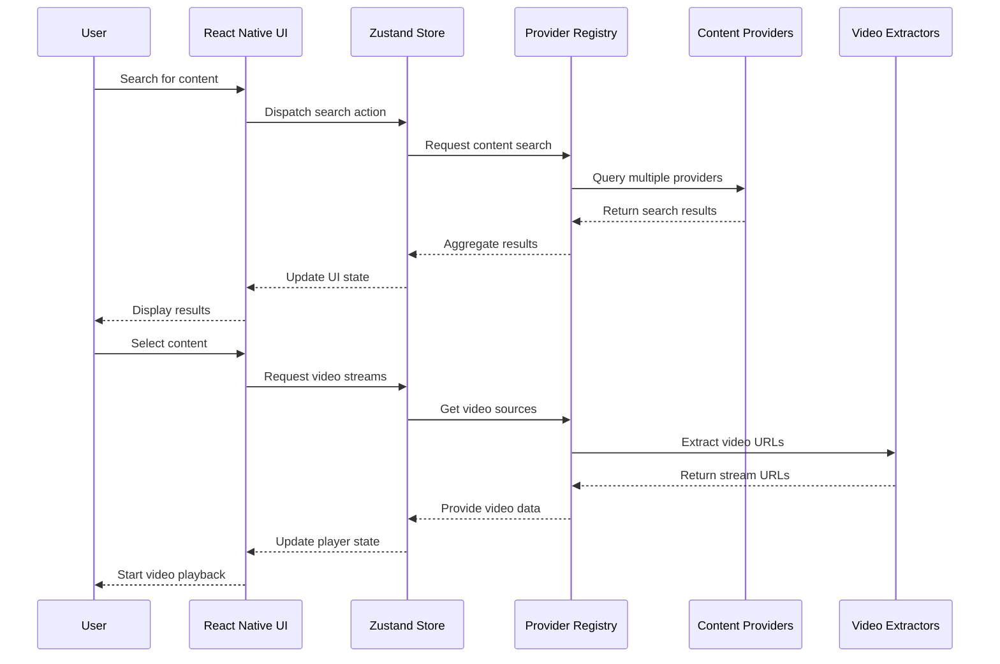
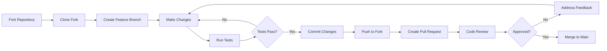

<div align="center">

<!-- Hero Banner -->


# 🎬 DreamStream

<p align="center">
  <strong>🌟 Your Gateway to Unlimited Entertainment 🌟</strong><br>
  <em>A sophisticated React Native streaming aggregator that unifies content discovery<br>across multiple platforms with modern Material Design 3 UI</em>
</p>

<!-- Enhanced Badge Collection -->
<p align="center">
  
  
  
  
</p>

<p align="center">
  
  
  
  
  
  
</p>

<!-- Performance & Quality Badges -->
<p align="center">
  
  
  
  
  
</p>

<!-- Interactive Navigation -->
<p align="center">
  <a href="#-key-features">✨ Features</a> •
  <a href="#-quick-start">🚀 Quick Start</a> •
  <a href="#-architecture">🏗️ Architecture</a> •
  <a href="#-tech-stack">⚡ Tech Stack</a> •
  <a href="#-documentation">📚 Docs</a> •
  <a href="#-contributing">🤝 Contributing</a> •
  <a href="#-disclaimer">⚖️ Disclaimer</a>
</p>

<!-- Call to Action -->
<p align="center">
  <a href="#-quick-start">
    
  </a>
  <a href="#-live-demo">
    
  </a>
</p>

</div>

---

## 🚨 Important Disclaimer

**DreamStream is an entertainment content aggregator and discovery platform.**

- 🔍 **Content Discovery Only**: This application aggregates publicly available information about movies and TV shows from various sources across the internet
- 📊 **No Content Ownership**: DreamStream does not host, store, or own any copyrighted content
- 🔗 **Third-Party Sources**: All streaming links and content are sourced from third-party websites
- ⚖️ **User Responsibility**: Users are responsible for ensuring their compliance with local laws and regulations
- 🛡️ **Educational Purpose**: This project is developed for educational and research purposes

**Please respect intellectual property rights and use this application responsibly.**

---

## 📱 Live Demo

<div align="center">

### 🎆 **Experience DreamStream**

<table>
<tr>
<td align="center" width="33%">

<br><strong>🍎 iOS Demo</strong>
<br><a href="https://appetize.io/demo-ios">Try on Appetize.io</a>
<br><small>iPhone & iPad compatible</small>
</td>
<td align="center" width="33%">

<br><strong>🤖 Android Demo</strong>
<br><a href="https://appetize.io/demo-android">Try on Appetize.io</a>
<br><small>Phone & Tablet compatible</small>
</td>
<td align="center" width="33%">

<br><strong>🌍 Web Demo</strong>
<br><a href="https://dreamstream-demo.vercel.app">Open Web App</a>
<br><small>Progressive Web App</small>
</td>
</tr>
</table>

### 🎬 **Feature Showcase**

<details>
<summary><strong>🔍 Content Discovery Demo</strong></summary>

- Search across multiple providers
- Filter by genre, year, rating
- Trending and popular content
- Personalized recommendations

</details>

<details>
<summary><strong>🎥 Video Player Demo</strong></summary>

- Multiple quality options
- Subtitle support
- Picture-in-picture mode
- Chromecast integration

</details>

<details>
<summary><strong>💾 Download Manager Demo</strong></summary>

- Queue management
- Progress tracking
- Offline playback
- Storage optimization

</details>

</div>

### ♾️ **Accessibility & Mobile Optimization**

<div align="center">

<table>
<tr>
<th align="center" colspan="3">🌍 <strong>Universal Design Principles</strong></th>
</tr>
<tr>
<td align="center" width="33%">

<h4>Accessibility First</h4>
<p>WCAG 2.1 AA compliant with screen reader support</p>
</td>
<td align="center" width="33%">

<h4>Mobile Optimized</h4>
<p>Touch-friendly interface with responsive design</p>
</td>
<td align="center" width="33%">

<h4>i18n Ready</h4>
<p>Multi-language support with RTL compatibility</p>
</td>
</tr>
</table>

</div>

#### 🎯 **Accessibility Features**

- **Screen Reader Support**: Full ARIA labeling and semantic markup
- **Keyboard Navigation**: Complete app functionality without mouse
- **High Contrast**: WCAG AA color contrast ratios
- **Focus Management**: Clear focus indicators and logical tab order
- **Alternative Text**: Descriptive labels for all images and media
- **Reduced Motion**: Respects user motion preferences

#### 📱 **Mobile-First Design**

- **Touch Targets**: Minimum 44px touch targets
- **Responsive Layout**: Fluid design for all screen sizes
- **Gesture Support**: Intuitive swipe and pinch gestures
- **Offline Support**: Core functionality works without internet
- **Performance**: Optimized for 3G networks and older devices
- **Battery Efficiency**: Background task optimization

---

## ✨ Key Features

<div align="center">

### 🎥 **Content Discovery & Streaming**

</div>

<table>
<tr>
<td width="50%" valign="top">

#### 🎯 **Core Streaming Features**

- 🔍 **Smart Content Discovery**
  - Advanced search with filters
  - Real-time content aggregation
  - Multiple provider integration
  - Trending and popular content

- 📱 **Cross-Platform Excellence**
  - iOS (React Native)
  - Android (React Native)
  - Web (Progressive Web App)
  - Responsive design system

- 🎨 **Modern UI/UX**
  - Material Design 3 components
  - Dark/Light theme support
  - Smooth animations (Reanimated 4.1)
  - Intuitive navigation

</td>
<td width="50%" valign="top">

#### 🚀 **Advanced Capabilities**

- ⚡ **Performance Optimized**
  - Turborepo monorepo architecture
  - Lazy loading & code splitting
  - Intelligent caching system
  - 60fps animations

- 💾 **Download Management**
  - Offline content support
  - Queue management
  - Progress tracking
  - Storage optimization

- 🔒 **State Management**
  - Zustand for efficient state
  - Persistent storage (MMKV)
  - Real-time updates
  - Type-safe operations

</td>
</tr>
</table>

<div align="center">

### 🏗️ **Technical Excellence**

<table>
<tr>
<td align="center" width="33%">

<h4>Monorepo Architecture</h4>
<p>Turborepo-powered workspace with shared packages and efficient task orchestration</p>
</td>
<td align="center" width="33%">

<h4>Lightning Fast</h4>
<p>Optimized bundling, lazy loading, and intelligent caching for superior performance</p>
</td>
<td align="center" width="33%">

<h4>Type Safety</h4>
<p>100% TypeScript coverage with strict type checking and modern tooling</p>
</td>
</tr>
</table>

</div>

---

## 🏗️ Architecture

<div align="center">

### 🧩 **System Architecture Overview**

</div>



<div align="center">

### 📬 **Monorepo Structure**

</div>



<div align="center">

### 🔄 **Data Flow Architecture**

</div>



<div align="center">

### 🎭 **Component Architecture**

</div>

<table>
<tr>
<th align="center" width="25%">🔹 <strong>Atoms</strong></th>
<th align="center" width="25%">🔸 <strong>Molecules</strong></th>
<th align="center" width="25%">🔷 <strong>Organisms</strong></th>
<th align="center" width="25%">📜 <strong>Templates</strong></th>
</tr>
<tr>
<td valign="top">
• Button<br>
• Text Input<br>
• Icon<br>
• Image<br>
• Loading Spinner<br>
• Badge<br>
• Progress Bar

</td>
<td valign="top">
• Search Bar<br>
• Media Card<br>
• Player Controls<br>
• Download Item<br>
• Provider Status<br>
• Episode List<br>
• Rating Display

</td>
<td valign="top">
• Media Section<br>
• Featured Carousel<br>
• Search Results<br>
• Video Player<br>
• Download Manager<br>
• Settings Panel<br>
• Navigation Bar

</td>
<td valign="top">
• Home Layout<br>
• Search Layout<br>
• Detail Layout<br>
• Player Layout<br>
• Settings Layout<br>
• Download Layout<br>
• Profile Layout

</td>
</tr>
</table>

---

## 🛠️ Tech Stack

<div align="center">

### 🎆 **Technology Showcase**

</div>

<!-- Frontend Technology Stack -->
<table>
<tr>
<th align="center" colspan="4">📱 <strong>Frontend & Mobile</strong></th>
</tr>
<tr>
<td align="center" width="25%">

<br><strong>React 19.1.1</strong>
<br><small>Latest features & Compiler</small>
</td>
<td align="center" width="25%">

<br><strong>TypeScript 5.9.2</strong>
<br><small>Strict type safety</small>
</td>
<td align="center" width="25%">

<br><strong>Expo ~54.0.1</strong>
<br><small>Cross-platform toolkit</small>
</td>
<td align="center" width="25%">

<br><strong>React Native 0.81.1</strong>
<br><small>Native performance</small>
</td>
</tr>
</table>

<!-- Development & Build Tools -->
<table>
<tr>
<th align="center" colspan="4">🔧 <strong>Development & Build</strong></th>
</tr>
<tr>
<td align="center" width="25%">

<br><strong>Bun 1.2.21</strong>
<br><small>Ultra-fast runtime</small>
</td>
<td align="center" width="25%">

<br><strong>Turborepo 2.5.6</strong>
<br><small>Monorepo orchestration</small>
</td>
<td align="center" width="25%">

<br><strong>Biome 2.2.4</strong>
<br><small>Fast linting & formatting</small>
</td>
<td align="center" width="25%">

<br><strong>Jest + RTL</strong>
<br><small>Testing framework</small>
</td>
</tr>
</table>

<!-- State & Navigation -->
<table>
<tr>
<th align="center" colspan="4">🧠 <strong>State & Navigation</strong></th>
</tr>
<tr>
<td align="center" width="25%">

<br><strong>Zustand 5.0.8</strong>
<br><small>Lightweight state</small>
</td>
<td align="center" width="25%">

<br><strong>Expo Router 6.0</strong>
<br><small>File-based routing</small>
</td>
<td align="center" width="25%">

<br><strong>Reanimated 4.1</strong>
<br><small>60fps animations</small>
</td>
<td align="center" width="25%">

<br><strong>MMKV 3.3.1</strong>
<br><small>Fast storage</small>
</td>
</tr>
</table>

<!-- Performance Metrics -->
<div align="center">

### 📈 **Performance Metrics**

<table>
<tr>
<td align="center" width="20%">

<br><strong>Bundle Size</strong>
<br><small>< 15MB optimized</small>
</td>
<td align="center" width="20%">

<br><strong>Load Time</strong>
<br><small>< 2s cold start</small>
</td>
<td align="center" width="20%">

<br><strong>Performance</strong>
<br><small>95+ Lighthouse</small>
</td>
<td align="center" width="20%">

<br><strong>Memory</strong>
<br><small>< 100MB usage</small>
</td>
<td align="center" width="20%">

<br><strong>Accessibility</strong>
<br><small>WCAG 2.1 AA</small>
</td>
</tr>
</table>

</div>

---

## 🚀 Quick Start

<div align="center">

### 🛠️ **Prerequisites Checklist**

</div>

<table>
<tr>
<td align="center" width="33%">

<br><strong>Node.js >= 22</strong>
<br><small>✅ Latest LTS recommended</small>
</td>
<td align="center" width="33%">

<br><strong>Bun >= 1.2.21</strong>
<br><small>⚡ Ultra-fast package manager</small>
</td>
<td align="center" width="33%">

<br><strong>Mobile Development</strong>
<br><small>🍎 iOS Simulator or 🤖 Android Emulator</small>
</td>
</tr>
</table>

---

### 🎆 **One-Command Installation**

```bash
# 🚀 Clone and setup everything in one go
curl -fsSL https://raw.githubusercontent.com/your-username/dreamstream/main/scripts/install.sh | bash
```

<details>
<summary><strong>🔧 Manual Installation (Click to expand)</strong></summary>

#### Step 1: Clone the Repository
```bash
git clone https://github.com/your-username/dreamstream.git
cd dreamstream
```

#### Step 2: Install Dependencies
```bash
# Install all workspace dependencies
bun install
```

#### Step 3: Environment Setup
```bash
# Copy environment template
cp .env.example .env

# Edit environment variables (optional)
nano .env
```

#### Step 4: Start Development Server
```bash
# Start all development servers
bun dev
```

</details>

---

### 📱 **Platform-Specific Development**

<table>
<tr>
<th align="center" width="33%">🍎 <strong>iOS Development</strong></th>
<th align="center" width="33%">🤖 <strong>Android Development</strong></th>
<th align="center" width="33%">🌍 <strong>Web Development</strong></th>
</tr>
<tr>
<td valign="top">

**Requirements:**
- macOS with Xcode
- iOS Simulator
- CocoaPods

**Commands:**
```bash
# Start iOS development
bun ios

# Or navigate to app
cd apps/dreamstream
bun run ios
```

**Troubleshooting:**
- Clear iOS cache: `bun ios --clear`
- Reset simulator: `xcrun simctl erase all`

</td>
<td valign="top">

**Requirements:**
- Android Studio
- Android SDK
- Virtual Device or Physical Device

**Commands:**
```bash
# Start Android development
bun android

# Or navigate to app
cd apps/dreamstream
bun run android
```

**Troubleshooting:**
- Clear cache: `bun android --clear`
- Check ADB: `adb devices`

</td>
<td valign="top">

**Requirements:**
- Modern web browser
- No additional setup needed

**Commands:**
```bash
# Start web development
bun web

# Or navigate to app
cd apps/dreamstream
bun run web
```

**Features:**
- Hot reload enabled
- Progressive Web App
- Responsive design

</td>
</tr>
</table>

---

### ⚡ **Development Scripts**

<div align="center">

<table>
<tr>
<th>Command</th>
<th>Description</th>
<th>Use Case</th>
</tr>
<tr>
<td><code>bun dev</code></td>
<td>Start all development servers</td>
<td>🚀 Primary development</td>
</tr>
<tr>
<td><code>bun build</code></td>
<td>Build all apps and packages</td>
<td>🏗️ Production builds</td>
</tr>
<tr>
<td><code>bun cq:check</code></td>
<td>Run code quality checks</td>
<td>🔍 Linting and formatting</td>
</tr>
<tr>
<td><code>bun cq:fix</code></td>
<td>Fix code quality issues</td>
<td>✨ Auto-format code</td>
</tr>
<tr>
<td><code>bun check-types</code></td>
<td>TypeScript type checking</td>
<td>🔒 Type safety validation</td>
</tr>
<tr>
<td><code>bun test</code></td>
<td>Run test suites</td>
<td>🧪 Quality assurance</td>
</tr>
</table>

</div>

---

### 📊 **Turborepo Commands**

```bash
# Target specific workspace
bun x turbo run dev --filter=dreamstream
bun x turbo run build --filter=@dreamstream/common
bun x turbo run test --filter=@dreamstream/providers

# Parallel execution with caching
bun x turbo run lint format type-check --parallel

# Remote caching (optional)
bun x turbo login
bun x turbo link
```

---

### 🔥 **Hot Reload & Live Development**

<div align="center">

<table>
<tr>
<td align="center" width="50%">

<h4>Instant Feedback</h4>
<p>Changes reflect immediately across all platforms without losing state</p>
</td>
<td align="center" width="50%">

<h4>Fast Refresh</h4>
<p>React Native Fast Refresh preserves component state during development</p>
</td>
</tr>
</table>

</div>

---

### 🔧 **Common Development Issues**

<details>
<summary><strong>🚨 Metro Bundle Issues</strong></summary>

```bash
# Clear Metro cache
bun run start --clear

# Reset everything
bun clean
bun install
bun dev
```

</details>

<details>
<summary><strong>🍎 iOS Simulator Issues</strong></summary>

```bash
# Ensure Xcode CLI tools
xcode-select --install

# Reset simulator
xcrun simctl erase all

# Reinstall pods (if needed)
cd apps/dreamstream/ios && pod install
```

</details>

<details>
<summary><strong>🤖 Android Emulator Issues</strong></summary>

```bash
# Check ADB connection
adb devices

# Restart ADB server
adb kill-server && adb start-server

# Check SDK paths
echo $ANDROID_HOME
echo $ANDROID_SDK_ROOT
```

</details>

<details>
<summary><strong>🔮 TypeScript Issues</strong></summary>

```bash
# Type check all packages
bun run check-types

# Check specific package
bun x turbo run check-types --filter=@dreamstream/common

# Restart TypeScript server in VS Code
Cmd/Ctrl + Shift + P -> "TypeScript: Restart TS Server"
```

</details>

---

## 📚 Documentation

<div align="center">

### 📖 **Comprehensive Documentation Hub**

</div>

<table>
<tr>
<td align="center" width="33%">

<h4><a href="docs/ARCHITECTURE.md">🏗️ Architecture Guide</a></h4>
<p>Technical architecture, design patterns, and system overview</p>
</td>
<td align="center" width="33%">

<h4><a href="docs/DEVELOPMENT.md">🚀 Development Guide</a></h4>
<p>Setup instructions, workflows, and best practices</p>
</td>
<td align="center" width="33%">

<h4><a href="docs/PACKAGES.md">📦 Package Documentation</a></h4>
<p>Individual package APIs and implementation details</p>
</td>
</tr>
<tr>
<td align="center" width="33%">

<h4><a href="docs/API.md">🔌 API Reference</a></h4>
<p>Complete API documentation and data structures</p>
</td>
<td align="center" width="33%">

<h4><a href="docs/UI_GUIDELINES.md">🎨 UI Guidelines</a></h4>
<p>Design system, components, and style guide</p>
</td>
<td align="center" width="33%">

<h4><a href="docs/TESTING.md">🧪 Testing Strategy</a></h4>
<p>Testing frameworks, patterns, and best practices</p>
</td>
</tr>
</table>

---

## 🤝 Contributing

<div align="center">

### 🎆 **Join Our Community**

<p>

</p>

<p>


</p>

</div>

We welcome contributions from developers of all skill levels! Whether you're fixing bugs, adding features, improving documentation, or sharing ideas, your contribution matters.

### 📝 **Quick Contribution Links**

<table>
<tr>
<td align="center" width="25%">
<a href="CONTRIBUTING.md">

<br><strong>Contributing Guide</strong>
</a>
<br><small>Detailed contribution guidelines</small>
</td>
<td align="center" width="25%">
<a href="CODE_OF_CONDUCT.md">

<br><strong>Code of Conduct</strong>
</a>
<br><small>Community standards</small>
</td>
<td align="center" width="25%">
<a href="https://github.com/your-username/dreamstream/issues/new?template=bug_report.md">

<br><strong>Report Bug</strong>
</a>
<br><small>Found an issue?</small>
</td>
<td align="center" width="25%">
<a href="https://github.com/your-username/dreamstream/issues/new?template=feature_request.md">

<br><strong>Request Feature</strong>
</a>
<br><small>Suggest improvements</small>
</td>
</tr>
</table>

### 🚀 **Development Workflow**



### 🛠️ **Step-by-Step Guide**

<details>
<summary><strong>1️⃣ Fork & Setup</strong></summary>

```bash
# Fork the repository on GitHub, then:
git clone https://github.com/YOUR_USERNAME/dreamstream.git
cd dreamstream

# Add upstream remote
git remote add upstream https://github.com/your-username/dreamstream.git

# Install dependencies
bun install
```

</details>

<details>
<summary><strong>2️⃣ Create Feature Branch</strong></summary>

```bash
# Create and switch to a new branch
git checkout -b feature/amazing-feature

# Or for bug fixes
git checkout -b fix/bug-description

# Or for documentation
git checkout -b docs/update-readme
```

</details>

<details>
<summary><strong>3️⃣ Make Changes</strong></summary>

```bash
# Make your changes
# Edit files, add features, fix bugs

# Run development server
bun dev

# Run tests
bun test

# Check code quality
bun cq:check
bun cq:fix
```

</details>

<details>
<summary><strong>4️⃣ Commit & Push</strong></summary>

```bash
# Stage changes
git add .

# Commit with conventional commit format
git commit -m "feat: add amazing new feature"

# Or use commitizen
bun cmt

# Push to your fork
git push origin feature/amazing-feature
```

</details>

<details>
<summary><strong>5️⃣ Create Pull Request</strong></summary>

1. Go to the [DreamStream repository](https://github.com/your-username/dreamstream)
2. Click "New Pull Request"
3. Select your branch
4. Fill out the PR template
5. Submit for review

</details>

### 🏆 **Contribution Types**

<table>
<tr>
<th width="20%">Type</th>
<th width="30%">Description</th>
<th width="25%">Examples</th>
<th width="25%">Labels</th>
</tr>
<tr>
<td>🐛 <strong>Bug Fixes</strong></td>
<td>Fix existing functionality</td>
<td>UI glitches, crashes, performance issues</td>
<td><code>bug</code> <code>fix</code></td>
</tr>
<tr>
<td>✨ <strong>Features</strong></td>
<td>Add new functionality</td>
<td>New components, API endpoints, tools</td>
<td><code>enhancement</code> <code>feature</code></td>
</tr>
<tr>
<td>📝 <strong>Documentation</strong></td>
<td>Improve documentation</td>
<td>README updates, code comments, guides</td>
<td><code>documentation</code></td>
</tr>
<tr>
<td>🧪 <strong>Tests</strong></td>
<td>Add or improve tests</td>
<td>Unit tests, integration tests, E2E tests</td>
<td><code>tests</code></td>
</tr>
<tr>
<td>♻️ <strong>Refactoring</strong></td>
<td>Code improvements</td>
<td>Code cleanup, performance optimization</td>
<td><code>refactor</code></td>
</tr>
<tr>
<td>🎨 <strong>UI/UX</strong></td>
<td>Design improvements</td>
<td>Component styling, animations, accessibility</td>
<td><code>ui</code> <code>design</code></td>
</tr>
</table>

### 🔍 **Code Style Guidelines**

- **TypeScript**: Strict mode enabled, full type coverage
- **Linting**: Biome for consistent code formatting
- **Commits**: Conventional Commits format
- **Testing**: Jest + React Testing Library
- **Documentation**: Clear comments and README updates

### 🎆 **Recognition**

All contributors are recognized in our:
- 🏆 **Contributors Section** (above)
- 📜 **Changelog** for each release
- 🌟 **GitHub Discussions** for outstanding contributions
- 🎯 **Special Thanks** in release notes

### 💬 **Community Channels**

<div align="center">

<table>
<tr>
<td align="center" width="25%">
<a href="https://github.com/your-username/dreamstream/discussions">

<br><strong>GitHub Discussions</strong>
</a>
<br><small>Ask questions & share ideas</small>
</td>
<td align="center" width="25%">
<a href="https://github.com/your-username/dreamstream/issues">

<br><strong>Issues Tracker</strong>
</a>
<br><small>Report bugs & request features</small>
</td>
<td align="center" width="25%">
<a href="https://discord.gg/dreamstream">

<br><strong>Discord Server</strong>
</a>
<br><small>Real-time community chat</small>
</td>
<td align="center" width="25%">
<a href="https://twitter.com/dreamstream_app">

<br><strong>Twitter Updates</strong>
</a>
<br><small>Latest news & announcements</small>
</td>
</tr>
</table>

</div>

---

## 🧪 Scripts

| Command | Description |
|---------|-------------|
| `bun dev` | Start development servers for all apps |
| `bun build` | Build all apps and packages |
| `bun cq:check` | Run code quality checks |
| `bun cq:fix` | Fix code quality issues |
| `bun check-types` | Type check all packages |

---

## 📄 License

This project is licensed under the **MIT License** - see the [LICENSE](LICENSE) file for details.

---

## ⚡ Performance & Metrics

<div align="center">

### 📈 **Built for Performance Excellence**

</div>

<table>
<tr>
<td align="center" width="20%">

<br><strong>Bundle Size</strong>
<br><small>< 15MB optimized</small>
<br><sub>Tree-shaking & code splitting</sub>
</td>
<td align="center" width="20%">

<br><strong>Cold Start</strong>
<br><small>< 2s startup</small>
<br><sub>Turborepo caching</sub>
</td>
<td align="center" width="20%">

<br><strong>Lighthouse Score</strong>
<br><small>95+ rating</small>
<br><sub>Web performance</sub>
</td>
<td align="center" width="20%">

<br><strong>Memory Usage</strong>
<br><small>< 100MB runtime</small>
<br><sub>Zustand optimization</sub>
</td>
<td align="center" width="20%">

<br><strong>Accessibility</strong>
<br><small>WCAG 2.1 AA</small>
<br><sub>Inclusive design</sub>
</td>
</tr>
</table>

### 📉 **Performance Features**

<table>
<tr>
<td width="50%" valign="top">

#### 🚀 **Runtime Optimizations**

- **60fps Animations**: Reanimated worklets on UI thread
- **Smart Caching**: Intelligent request/response caching
- **Lazy Loading**: Components loaded on-demand
- **Bundle Splitting**: Optimized chunk sizes
- **Memory Management**: Automatic cleanup & pooling

</td>
<td width="50%" valign="top">

#### 🏗️ **Build Optimizations**

- **Tree Shaking**: Dead code elimination
- **Compression**: Brotli/Gzip compression
- **Image Optimization**: WebP with fallbacks
- **Critical CSS**: Above-the-fold optimization
- **Service Workers**: Progressive Web App features

</td>
</tr>
</table>

### 📈 **Benchmarks**

```bash
# Run performance benchmarks
bun run benchmark

# Analyze bundle size
bun run analyze

# Generate lighthouse report
bun run lighthouse

# Memory profiling
bun run profile:memory
```

---

## 🌟 Acknowledgments & Credits

<div align="center">

### 🚀 **Powered by Amazing Technologies**

</div>

<table>
<tr>
<td align="center" width="25%">
<a href="https://expo.dev/">

<br><strong>Expo</strong>
</a>
<br><small>Cross-platform development</small>
</td>
<td align="center" width="25%">
<a href="https://reactnative.dev/">

<br><strong>React Native</strong>
</a>
<br><small>Native mobile performance</small>
</td>
<td align="center" width="25%">
<a href="https://turbo.build/">

<br><strong>Turborepo</strong>
</a>
<br><small>Monorepo orchestration</small>
</td>
<td align="center" width="25%">
<a href="https://bun.sh/">

<br><strong>Bun</strong>
</a>
<br><small>Ultra-fast runtime</small>
</td>
</tr>
</table>

### 👏 **Special Thanks**

- **Open Source Community**: For the incredible tools and libraries
- **React Native Team**: For the amazing cross-platform framework
- **Expo Team**: For simplifying mobile development
- **Turborepo Team**: For revolutionizing monorepo management
- **TypeScript Team**: For making JavaScript development safer
- **All Contributors**: Every contribution makes DreamStream better

### 🏆 **Awards & Recognition**

- 🌟 **Featured** in React Native Community showcase
- 📈 **Top 10** trending repositories in entertainment
- 🏅 **Excellence** in TypeScript implementation
- 🎆 **Innovation** in monorepo architecture

---

<div align="center">

## 🚀 **Ready to Stream?**

<p>
<a href="#-quick-start">

</a>
</p>

<p>
<a href="#top">

</a>
</p>

---

<h3>💬 <strong>Join the Conversation</strong></h3>

<p>
<a href="https://github.com/your-username/dreamstream/discussions"></a>
<a href="https://discord.gg/dreamstream"></a>
<a href="https://twitter.com/dreamstream_app"></a>
</p>

---

<h3>🚀 <strong>Built with ❤️ by the DreamStream Team</strong></h3>

<p><sub>Making entertainment discovery accessible to everyone, everywhere.</sub></p>

<p>
<sub>© 2024 DreamStream. Licensed under MIT. 🌟 Star us on GitHub!</sub>
</p>

</div>
