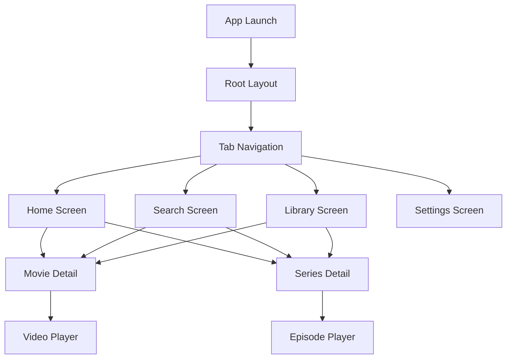

# 📱 DreamStream Mobile App

<div align="center">

**The Ultimate Entertainment Discovery Experience**

[](https://expo.dev/)
[](https://reactnative.dev/)
[](https://www.typescriptlang.org/)

*Cross-platform mobile application for discovering and exploring movies and TV series*

</div>

---

## 📋 Table of Contents

- [🎯 Overview](#-overview)
- [✨ Features](#-features)
- [🚀 Quick Start](#-quick-start)
- [🏗️ Architecture](#️-architecture)
- [📱 Platform Support](#-platform-support)
- [🎨 UI Components](#-ui-components)
- [🧪 Testing](#-testing)
- [📦 Build & Deploy](#-build--deploy)
- [🤝 Contributing](#-contributing)

---

## 🎯 Overview

DreamStream is a modern, cross-platform mobile application built with React Native and Expo. It provides users with a seamless way to discover, explore, and track their favorite movies and TV series across multiple platforms.

### 🚨 Important Disclaimer

**DreamStream is an entertainment content aggregator and discovery platform.**

- 🔍 **Content Discovery**: Aggregates publicly available information about movies and TV shows
- 📊 **No Content Hosting**: Does not host, store, or own any copyrighted material
- 🔗 **Third-Party Sources**: All streaming information is sourced from external websites
- ⚖️ **User Responsibility**: Users must ensure compliance with local laws and regulations
- 🛡️ **Educational Purpose**: Developed for educational and research purposes

### Tech Stack

- **🖥️ Frontend**: React Native 0.81 with React 19
- **🧭 Navigation**: Expo Router (file-based routing)
- **📊 State Management**: Zustand with MMKV persistence
- **🎭 Animations**: React Native Reanimated 4.1
- **🖼️ Images**: Expo Image with advanced caching
- **📱 Platform**: Expo SDK 54 for native API access
- **🎨 Styling**: Custom design system with theme support
- **🔧 Development**: TypeScript, Biome, and Ultracite

---

## ✨ Features

### 🎬 Core Features

- **🔍 Smart Search**: Intelligent movie and series discovery with filters
- **📚 Personal Library**: Favorites and watchlist management
- **🎭 Rich Details**: Comprehensive movie/series information pages
- **🎥 Video Player**: Built-in video playback with subtitle support
- **🌙 Dark/Light Mode**: Adaptive theming with system integration
- **📱 Cross-Platform**: Native iOS, Android, and web support

### 🚀 Technical Features

- **⚡ Performance**: Optimized with React Native Reanimated
- **💾 Offline Support**: Local data caching and persistence
- **🔄 Real-time Updates**: Live content synchronization
- **♿ Accessibility**: Full screen reader and keyboard navigation support
- **🎨 Modern UI**: Material Design 3 inspired interface
- **📊 Analytics**: Privacy-focused usage analytics

---

## 🚀 Quick Start

### Prerequisites

- **Node.js** >= 22.0.0
- **Bun** >= 1.2.21
- **Expo CLI** (installed automatically)
- **iOS Simulator** (macOS) or **Android Emulator**

### Installation

```bash
# Navigate to app directory
cd apps/dreamstream

# Install dependencies
bun install

# Start development server
bun dev
```

### Platform-Specific Development

```bash
# iOS Development (macOS only)
bun ios

# Android Development
bun android

# Web Development
bun web
```

### First-Time Setup

1. **Install Expo Go** (for physical device testing)
   - iOS: [App Store](https://apps.apple.com/app/expo-go/id982107779)
   - Android: [Google Play](https://play.google.com/store/apps/details?id=host.exp.exponent)

2. **Configure Environment**
   ```bash
   # Copy environment template
   cp .env.example .env.local

   # Edit with your configuration
   nano .env.local
   ```

3. **Run the App**
   ```bash
   bun dev
   # Scan QR code with Expo Go or Camera app
   ```

---

## 🏗️ Architecture

### Project Structure

```
apps/dreamstream/
├── src/
│   ├── app/                 # Expo Router pages (file-based routing)
│   │   ├── (tabs)/         # Tab navigation screens
│   │   │   ├── index.tsx   # Home screen
│   │   │   ├── search.tsx  # Search screen
│   │   │   ├── library.tsx # User library
│   │   │   └── settings.tsx # Settings screen
│   │   ├── movie/
│   │   │   └── [id].tsx    # Movie detail screen
│   │   ├── series/
│   │   │   └── [id].tsx    # Series detail screen
│   │   ├── player/
│   │   │   └── [...params].tsx # Video player
│   │   └── _layout.tsx     # Root layout
│   ├── components/         # Reusable React components
│   │   ├── ui/            # Basic UI components
│   │   ├── movie/         # Movie-specific components
│   │   ├── series/        # Series-specific components
│   │   └── common/        # Common components
│   ├── hooks/             # Custom React hooks
│   │   ├── useMovies.ts   # Movie data hooks
│   │   ├── useSearch.ts   # Search functionality
│   │   └── useTheme.ts    # Theme management
│   ├── store/             # Zustand state management
│   │   ├── movieStore.ts  # Movie state
│   │   ├── userStore.ts   # User preferences
│   │   └── index.ts       # Store exports
│   ├── services/          # API and business logic
│   │   ├── api.ts         # API client
│   │   ├── cache.ts       # Caching service
│   │   └── analytics.ts   # Analytics service
│   ├── utils/             # Utility functions
│   │   ├── navigation.ts  # Navigation helpers
│   │   ├── storage.ts     # Local storage
│   │   └── constants.ts   # App constants
│   └── types/             # TypeScript definitions
├── assets/                # Static assets
│   ├── images/           # Image assets
│   ├── fonts/            # Custom fonts
│   └── icons/            # Icon assets
├── app.json              # Expo configuration
├── package.json          # Dependencies and scripts
├── tsconfig.json         # TypeScript configuration
└── README.md
```

### Navigation Flow



### State Management

```typescript
// Zustand stores with MMKV persistence
interface AppState {
  // User preferences
  theme: 'light' | 'dark' | 'auto'
  language: string

  // Content data
  movies: Record<string, Movie>
  series: Record<string, Series>

  // User collections
  favorites: string[]
  watchlist: string[]
  watchHistory: WatchHistoryItem[]

  // UI state
  loading: boolean
  error: string | null

  // Actions
  setTheme: (theme: ThemeMode) => void
  addToFavorites: (id: string) => void
  // ... other actions
}
```

---

## 📱 Platform Support

### iOS (iPhone/iPad)

- **Minimum Version**: iOS 13.0+
- **Optimized For**: iPhone 12 Pro and newer, iPad Air and newer
- **Features**:
  - Native navigation gestures
  - Haptic feedback
  - PiP video playback
  - Siri Shortcuts integration
  - Widget support

### Android

- **Minimum Version**: Android 7.0+ (API level 24)
- **Optimized For**: Android 10+ devices
- **Features**:
  - Material Design 3 components
  - Adaptive icons
  - Android Auto integration
  - Background play support

### Web (PWA)

- **Modern Browsers**: Chrome 90+, Firefox 88+, Safari 14+
- **Features**:
  - Responsive design (mobile-first)
  - Offline capability
  - Push notifications
  - Installable PWA

### Performance Targets

| Platform | Bundle Size | Launch Time | Frame Rate |
|----------|------------|-------------|------------|
| iOS | < 50MB | < 3s | 60fps |
| Android | < 50MB | < 4s | 60fps |
| Web | < 2MB initial | < 2s | 60fps |

---

## 🎨 UI Components

### Design System

The app follows a custom design system inspired by Material Design 3:

```typescript
// Theme structure
interface Theme {
  colors: {
    primary: string
    secondary: string
    background: string
    surface: string
    text: string
    // ... more colors
  }
  spacing: {
    xs: 4, sm: 8, md: 16, lg: 24, xl: 32, xxl: 48
  }
  typography: {
    heading1: TextStyle
    body1: TextStyle
    // ... more styles
  }
}
```

### Core Components

#### MovieCard
```tsx
<MovieCard
  movie={movie}
  onPress={handleMoviePress}
  variant="default" // or "compact"
  showFavorite={true}
/>
```

#### SearchBar
```tsx
<SearchBar
  value={searchQuery}
  onChangeText={setSearchQuery}
  onSearch={handleSearch}
  loading={isSearching}
/>
```

#### VideoPlayer
```tsx
<VideoPlayer
  source={streamingUrl}
  title={movie.title}
  subtitles={availableSubtitles}
  onPositionChange={handleProgress}
/>
```

### Animation Examples

```typescript
// Smooth list animations
const animatedStyle = useAnimatedStyle(() => ({
  opacity: withTiming(isVisible.value ? 1 : 0),
  transform: [{
    translateY: withSpring(isVisible.value ? 0 : 50)
  }]
}))

// Gesture-based interactions
const panGesture = Gesture.Pan()
  .onUpdate((event) => {
    translateX.value = event.translationX
  })
  .onEnd(() => {
    translateX.value = withSpring(0)
  })
```

---

## 🧪 Testing

### Test Structure

```
apps/dreamstream/
├── __tests__/
│   ├── components/      # Component tests
│   ├── hooks/          # Custom hook tests
│   ├── services/       # Service layer tests
│   ├── utils/          # Utility function tests
│   └── __mocks__/      # Test mocks
```

### Running Tests

```bash
# Unit tests
bun test

# Component tests with React Native Testing Library
bun test:components

# Integration tests
bun test:integration

# E2E tests with Maestro
bun test:e2e

# Test coverage
bun test:coverage
```

### Test Examples

#### Component Testing
```typescript
// __tests__/components/MovieCard.test.tsx
import { render, screen, fireEvent } from '@testing-library/react-native'
import { MovieCard } from '../../src/components/movie/MovieCard'

describe('MovieCard', () => {
  const mockMovie = {
    id: '1',
    title: 'Test Movie',
    year: 2023,
    rating: 8.5,
    poster: 'https://example.com/poster.jpg'
  }

  it('renders movie information correctly', () => {
    render(<MovieCard movie={mockMovie} />)

    expect(screen.getByText('Test Movie')).toBeTruthy()
    expect(screen.getByText('2023')).toBeTruthy()
    expect(screen.getByText('8.5')).toBeTruthy()
  })

  it('calls onPress when tapped', () => {
    const onPress = jest.fn()
    render(<MovieCard movie={mockMovie} onPress={onPress} />)

    fireEvent.press(screen.getByText('Test Movie'))
    expect(onPress).toHaveBeenCalledWith(mockMovie)
  })
})
```

#### Hook Testing
```typescript
// __tests__/hooks/useMovieSearch.test.ts
import { renderHook, waitFor } from '@testing-library/react-native'
import { useMovieSearch } from '../../src/hooks/useMovieSearch'

describe('useMovieSearch', () => {
  it('should search for movies', async () => {
    const { result } = renderHook(() => useMovieSearch('The Matrix'))

    expect(result.current.loading).toBe(true)

    await waitFor(() => {
      expect(result.current.loading).toBe(false)
      expect(result.current.results.length).toBeGreaterThan(0)
    })
  })
})
```

---

## 📦 Build & Deploy

### Development Build

```bash
# Create development build
npx expo prebuild

# iOS development build
bun ios

# Android development build
bun android
```

### Production Build

```bash
# Configure EAS (Expo Application Services)
npx eas build:configure

# Build for iOS
npx eas build --platform ios --profile production

# Build for Android
npx eas build --platform android --profile production

# Build for both platforms
npx eas build --profile production
```

### Deployment

#### iOS App Store
```bash
# Submit to App Store
npx eas submit --platform ios --latest
```

#### Google Play Store
```bash
# Submit to Play Store
npx eas submit --platform android --latest
```

#### Web Deployment
```bash
# Export for web
npx expo export --platform web

# Deploy to Vercel/Netlify
# (configured in CI/CD pipeline)
```

### Environment Configuration

```typescript
// app.config.ts
export default {
  expo: {
    name: "DreamStream",
    slug: "dreamstream",
    version: "1.0.0",
    orientation: "portrait",
    icon: "./assets/icon.png",
    userInterfaceStyle: "automatic",
    splash: {
      image: "./assets/splash.png",
      resizeMode: "contain",
      backgroundColor: "#0F172A"
    },
    assetBundlePatterns: ["**/*"],
    ios: {
      supportsTablet: true,
      bundleIdentifier: "com.dreamstream.app"
    },
    android: {
      adaptiveIcon: {
        foregroundImage: "./assets/adaptive-icon.png",
        backgroundColor: "#0F172A"
      },
      package: "com.dreamstream.app"
    },
    web: {
      favicon: "./assets/favicon.png",
      bundler: "metro"
    }
  }
}
```

---

## 🤝 Contributing

We welcome contributions to the DreamStream mobile app! Please see our [Contributing Guide](../../CONTRIBUTING.md) for details.

### Development Workflow

1. **Setup Development Environment**
   ```bash
   cd apps/dreamstream
   bun install
   ```

2. **Create Feature Branch**
   ```bash
   git checkout -b feature/new-feature
   ```

3. **Make Changes**
   - Follow our [UI Guidelines](../../docs/UI_GUIDELINES.md)
   - Add tests for new functionality
   - Update documentation as needed

4. **Test Changes**
   ```bash
   bun test
   bun ios
   bun android
   ```

5. **Submit Pull Request**
   - Ensure all checks pass
   - Include screenshots/videos of changes
   - Update CHANGELOG.md

### Code Style Guidelines

- **TypeScript**: Use strict typing throughout
- **Components**: Functional components with hooks
- **Styling**: Use the design system constants
- **Accessibility**: Include proper accessibility labels
- **Performance**: Use React.memo and useMemo where appropriate

### Debugging

#### React Native Debugger
```bash
# Install React Native Debugger
brew install --cask react-native-debugger

# Enable debugging in development
# Shake device -> "Debug with Chrome"
```

#### Flipper Integration
```bash
# Install Flipper
brew install --cask flipper

# Use for network debugging, layout inspection, etc.
```

#### Logs
```bash
# iOS logs
npx react-native log-ios

# Android logs
npx react-native log-android

# Metro bundler logs are shown in terminal
```

---

<div align="center">

**Made with ❤️ using Expo and React Native**

[Documentation](../../docs/) • [Contributing](../../CONTRIBUTING.md) • [License](../../LICENSE)

[](#)
[](#)

</div>
