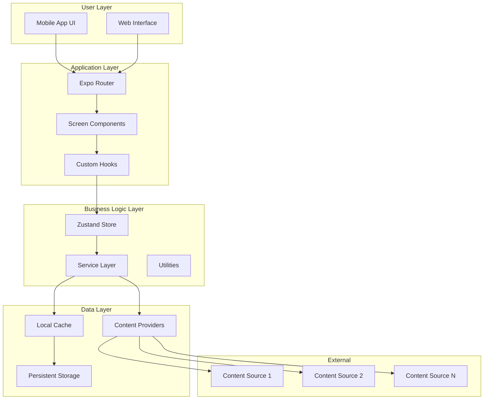
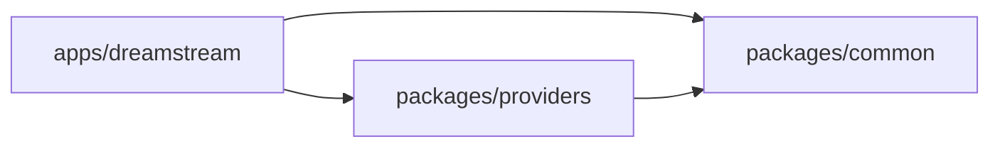
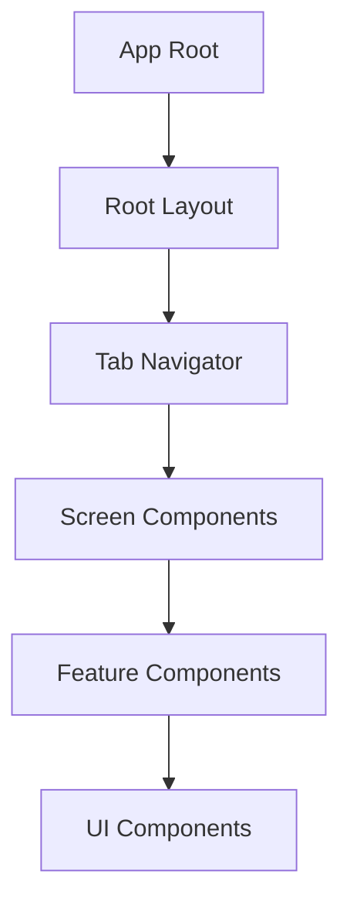
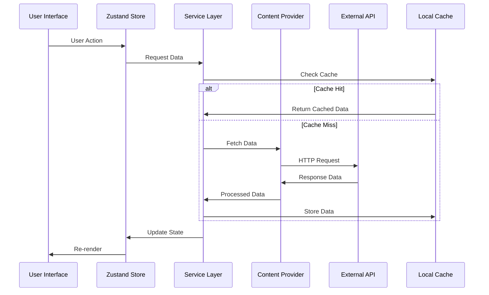
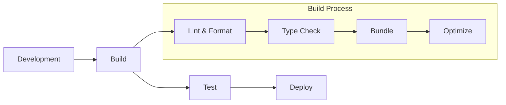

# 🏗️ Architecture Guide

<div align="center">

**DreamStream Technical Architecture & Design Decisions**

*A comprehensive guide to understanding the system design and implementation*

</div>

---

## 📋 Table of Contents

- [🎯 Overview](#-overview)
- [🏛️ System Architecture](#️-system-architecture)
- [📦 Monorepo Structure](#-monorepo-structure)
- [🔧 Technology Stack](#-technology-stack)
- [📱 Mobile Architecture](#-mobile-architecture)
- [🌐 Data Flow](#-data-flow)
- [🔌 Provider System](#-provider-system)
- [🎨 UI Architecture](#-ui-architecture)
- [⚡ Performance Strategy](#-performance-strategy)
- [🔐 Security Considerations](#-security-considerations)
- [📊 State Management](#-state-management)
- [🧪 Testing Strategy](#-testing-strategy)
- [🚀 Deployment](#-deployment)

---

## 🎯 Overview

DreamStream follows a **modular monorepo architecture** designed for scalability, maintainability, and developer experience. The system is built around the principle of **separation of concerns** with clear boundaries between different layers.

### Core Principles

- 🧩 **Modular Design**: Each package has a single responsibility
- 🔄 **Reactive Architecture**: Event-driven with reactive state management
- 📱 **Cross-Platform**: Shared logic with platform-specific implementations
- ⚡ **Performance-First**: Optimized for speed and efficiency
- 🔒 **Type Safety**: Full TypeScript coverage across the entire stack

---

## 🏛️ System Architecture



---

## 📦 Monorepo Structure

### Package Organization

```
dreamstream/
├── apps/
│   └── dreamstream/          # Main React Native application
│       ├── src/
│       │   ├── app/         # Expo Router pages
│       │   ├── components/  # React components
│       │   ├── hooks/       # Custom React hooks
│       │   ├── store/       # Zustand stores
│       │   └── utils/       # App-specific utilities
│       ├── assets/          # Static assets
│       └── app.json         # Expo configuration
├── packages/
│   ├── common/              # Shared utilities and types
│   │   ├── src/
│   │   │   ├── types/       # TypeScript definitions
│   │   │   ├── utils/       # Utility functions
│   │   │   └── constants/   # Application constants
│   │   └── package.json
│   └── providers/           # Content provider implementations
│       ├── src/
│       │   ├── base/        # Base provider classes
│       │   ├── scrapers/    # Website scrapers
│       │   └── adapters/    # Data adapters
│       └── package.json
└── docs/                    # Documentation
```

### Package Dependencies



---

## 🔧 Technology Stack

### Core Technologies

| Layer | Technology | Purpose |
|-------|------------|---------|
| **Runtime** | Node.js 22+ | JavaScript runtime environment |
| **Package Manager** | Bun 1.2.21+ | Fast package installation and task running |
| **Monorepo** | Turborepo | Build system and task orchestration |
| **Language** | TypeScript 5.9+ | Type-safe JavaScript development |
| **Mobile Framework** | React Native 0.81 | Cross-platform mobile development |
| **React Version** | React 19.1 | Latest React features and performance |
| **Navigation** | Expo Router 6.0 | File-based routing system |
| **Development** | Expo SDK 54 | Native API access and development tools |

### State Management & Data

| Component | Technology | Purpose |
|-----------|------------|---------|
| **State Store** | Zustand 5.0 | Lightweight state management |
| **HTTP Client** | Axios 1.11 | Promise-based HTTP requests |
| **HTML Parsing** | Cheerio 1.1 | Server-side HTML manipulation |
| **Local Storage** | React Native MMKV 3.3 | High-performance key-value storage |
| **Gestures** | React Native Gesture Handler 2.28 | Native gesture recognition |
| **Animations** | React Native Reanimated 4.1 | Smooth 60fps animations |

### Code Quality & Development

| Tool | Technology | Purpose |
|------|------------|---------|
| **Linting & Formatting** | Biome via Ultracite | Lightning-fast code quality |
| **Pre-commit Hooks** | Husky 9.1 | Git hooks for quality gates |
| **Staged Files** | Lint-staged 16.1 | Run tasks on git staged files |
| **Commit Convention** | git-cz 4.9 | Conventional commit messages |

---

## 📱 Mobile Architecture

### Component Hierarchy



### Screen Organization

```typescript
// apps/dreamstream/src/app structure
app/
├── (tabs)/              # Tab-based navigation
│   ├── index.tsx       # Home screen
│   ├── search.tsx      # Search screen
│   ├── library.tsx     # User library
│   └── settings.tsx    # Settings screen
├── movie/
│   └── [id].tsx        # Dynamic movie detail
├── series/
│   └── [id].tsx        # Dynamic series detail
├── player/
│   └── [...params].tsx # Video player
└── _layout.tsx         # Root layout
```

### State Architecture

```typescript
// Zustand store structure
interface AppState {
  // User preferences
  theme: 'light' | 'dark' | 'auto'
  language: string

  // Content state
  movies: Movie[]
  series: Series[]
  favorites: string[]
  watchlist: string[]

  // UI state
  loading: boolean
  error: string | null

  // Actions
  setTheme: (theme: ThemeMode) => void
  addToFavorites: (id: string) => void
  // ... other actions
}
```

---

## 🌐 Data Flow

### Request-Response Cycle



### Data Transformation Pipeline

1. **Raw Data** → External APIs (various formats)
2. **Scraped Data** → Content providers (HTML parsing)
3. **Normalized Data** → Common types (standardized format)
4. **Cached Data** → Local storage (performance optimization)
5. **UI Data** → React components (presentation layer)

---

## 🔌 Provider System

The provider system abstracts content sources with a unified interface.

### Base Provider Architecture

```typescript
// packages/providers/src/base/BaseProvider.ts
abstract class BaseProvider {
  abstract name: string
  abstract baseUrl: string

  abstract search(query: string): Promise<SearchResult[]>
  abstract getMovie(id: string): Promise<Movie>
  abstract getSeries(id: string): Promise<Series>
  abstract getStreamingLinks(id: string): Promise<StreamingLink[]>

  protected async makeRequest(url: string): Promise<string> {
    // Common HTTP request logic
  }

  protected parseHtml(html: string): CheerioStatic {
    // HTML parsing utilities
  }
}
```

### Provider Implementation

```typescript
// Example provider implementation
class ExampleProvider extends BaseProvider {
  name = 'Example Provider'
  baseUrl = 'https://example.com'

  async search(query: string): Promise<SearchResult[]> {
    const html = await this.makeRequest(`${this.baseUrl}/search?q=${query}`)
    const $ = this.parseHtml(html)

    return $('.result-item').map((_, element) => ({
      id: $(element).data('id'),
      title: $(element).find('.title').text(),
      year: $(element).find('.year').text(),
      type: $(element).hasClass('movie') ? 'movie' : 'series'
    })).get()
  }
}
```

---

## 🎨 UI Architecture

### Design System

```typescript
// Theme structure
interface Theme {
  colors: {
    primary: string
    secondary: string
    background: string
    surface: string
    text: string
    textSecondary: string
    border: string
    error: string
    success: string
    warning: string
  }

  spacing: {
    xs: number    // 4
    sm: number    // 8
    md: number    // 16
    lg: number    // 24
    xl: number    // 32
    xxl: number   // 48
  }

  typography: {
    heading1: TextStyle
    heading2: TextStyle
    body: TextStyle
    caption: TextStyle
  }

  borderRadius: {
    sm: number    // 4
    md: number    // 8
    lg: number    // 12
    xl: number    // 16
  }
}
```

### Component Architecture

```typescript
// Component structure
interface ComponentProps {
  // Visual variants
  variant?: 'primary' | 'secondary' | 'outline'
  size?: 'small' | 'medium' | 'large'

  // State
  loading?: boolean
  disabled?: boolean

  // Accessibility
  accessibilityLabel?: string
  accessibilityRole?: string

  // Events
  onPress?: () => void
}
```

---

## ⚡ Performance Strategy

### Optimization Techniques

1. **Bundle Optimization**
   - Tree shaking with Expo/Metro
   - Code splitting by route
   - Dynamic imports for heavy components

2. **Runtime Performance**
   - React.memo for expensive components
   - useMemo for expensive calculations
   - useCallback for stable function references

3. **Image Optimization**
   - Expo Image with built-in caching
   - Progressive loading with placeholders
   - Automatic format selection (WebP, AVIF)

4. **Data Management**
   - MMKV for lightning-fast storage
   - Intelligent cache invalidation
   - Background data synchronization

### Performance Monitoring

```typescript
// Performance tracking
interface PerformanceMetrics {
  screenLoadTime: number
  searchResponseTime: number
  imageLoadTime: number
  memoryUsage: number
  crashRate: number
}
```

---

## 🔐 Security Considerations

### Content Scraping Ethics

- ✅ **Respect robots.txt** files
- ✅ **Rate limiting** to prevent server overload
- ✅ **User-Agent rotation** for responsible scraping
- ✅ **HTTPS only** for secure communications
- ❌ **No content storage** - links only
- ❌ **No copyright infringement** - aggregation only

### Application Security

```typescript
// Security measures
const securityConfig = {
  // Network security
  certificatePinning: true,
  requestTimeouts: 10000,
  maxRetries: 3,

  // Data protection
  sensitiveDataEncryption: true,
  localStorageEncryption: true,

  // User privacy
  analyticsOptIn: true,
  dataCollection: 'minimal',

  // Input validation
  queryParameterSanitization: true,
  urlValidation: true
}
```

---

## 📊 State Management

### Zustand Store Design

```typescript
// Store slices for better organization
interface MovieSlice {
  movies: Movie[]
  currentMovie: Movie | null
  setMovies: (movies: Movie[]) => void
  setCurrentMovie: (movie: Movie | null) => void
}

interface UserSlice {
  favorites: string[]
  watchlist: string[]
  settings: UserSettings
  addToFavorites: (id: string) => void
  removeFromFavorites: (id: string) => void
}

// Combined store
type AppStore = MovieSlice & UserSlice & /* other slices */
```

### State Persistence

```typescript
// MMKV storage adapter
const storage = {
  getItem: (name: string) => {
    const value = mmkv.getString(name)
    return value ? JSON.parse(value) : null
  },
  setItem: (name: string, value: any) => {
    mmkv.set(name, JSON.stringify(value))
  },
  removeItem: (name: string) => {
    mmkv.delete(name)
  }
}
```

---

## 🧪 Testing Strategy

### Testing Pyramid

```mermaid
pyramid
    title Testing Strategy
    top "E2E Tests (10%)"
    middle "Integration Tests (30%)"
    bottom "Unit Tests (60%)"
```

### Test Categories

1. **Unit Tests** (Jest + Testing Library)
   - Component rendering
   - Hook behavior
   - Utility functions
   - Provider logic

2. **Integration Tests** (Detox)
   - Screen navigation
   - User interactions
   - Data flow
   - Cross-component behavior

3. **E2E Tests** (Maestro)
   - Critical user journeys
   - Cross-platform scenarios
   - Performance benchmarks

---

## 🚀 Deployment

### Build Pipeline



### Deployment Targets

| Platform | Method | Configuration |
|----------|--------|---------------|
| **iOS** | Expo Application Services | `eas.json` |
| **Android** | Google Play Console | `eas.json` |
| **Web** | Vercel/Netlify | `app.json` web config |

### Environment Configuration

```typescript
// Environment-specific configs
const config = {
  development: {
    apiTimeout: 30000,
    debugMode: true,
    crashReporting: false
  },
  production: {
    apiTimeout: 10000,
    debugMode: false,
    crashReporting: true
  }
}
```

---

## 📈 Scalability Considerations

### Horizontal Scaling

- **Provider System**: Easy to add new content sources
- **Component Library**: Reusable UI components across platforms
- **Service Layer**: Abstracted business logic for reusability

### Performance Scaling

- **Lazy Loading**: Components and routes loaded on demand
- **Virtual Lists**: Efficient rendering of large datasets
- **Background Processing**: Heavy operations in separate threads

### Maintenance Scaling

- **Automated Testing**: Comprehensive test coverage
- **Code Quality Gates**: Pre-commit hooks and CI checks
- **Documentation**: Living documentation with code examples

---

<div align="center">

**[⬆ Back to Top](#-architecture-guide)**

*This architecture is designed to evolve with the project's needs while maintaining code quality and developer experience.*

</div>
