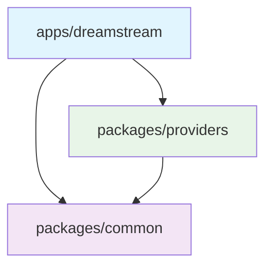

# 📦 Package Documentation

<div align="center">

**DreamStream Package Architecture & Usage**

*Detailed documentation for all packages in the DreamStream monorepo*

</div>

---

## 📋 Table of Contents

- [🎯 Overview](#-overview)
- [📱 Apps](#-apps)
- [📦 Packages](#-packages)
- [🔗 Dependencies](#-dependencies)
- [🛠️ Development](#️-development)
- [📚 API Reference](#-api-reference)

---

## 🎯 Overview

DreamStream uses a monorepo architecture with clear separation between applications and shared packages. This design promotes code reuse, maintainability, and consistent development practices.

### Package Types

| Type | Purpose | Examples |
|------|---------|----------|
| **Apps** | End-user applications | Mobile app, Web app |
| **Packages** | Shared libraries | Common utilities, Providers |

### Dependency Flow



---

## 📱 Apps

### `apps/dreamstream`

The main React Native application built with Expo Router.

#### 📄 Configuration

```json
{
  "name": "@dreamstream/app",
  "main": "expo-router/entry",
  "version": "1.0.0",
  "private": true
}
```

#### 🏗️ Structure

```
apps/dreamstream/
├── src/
│   ├── app/              # Expo Router pages
│   │   ├── (tabs)/      # Tab navigation
│   │   ├── movie/       # Movie details
│   │   ├── series/      # Series details
│   │   ├── player/      # Video player
│   │   └── _layout.tsx  # Root layout
│   ├── components/      # React components
│   ├── hooks/          # Custom React hooks
│   ├── store/          # Zustand stores
│   └── utils/          # App-specific utilities
├── assets/             # Static assets
└── app.json           # Expo configuration
```

#### 🔧 Key Dependencies

| Package | Version | Purpose |
|---------|---------|---------|
| `expo` | ~54.0.1 | Expo SDK |
| `react` | 19.1.1 | React library |
| `react-native` | 0.81.1 | React Native |
| `expo-router` | ~6.0.0 | File-based routing |
| `zustand` | 5.0.8 | State management |
| `react-native-reanimated` | ~4.1.0 | Animations |

#### 🚀 Scripts

```bash
# Development
bun dev          # Start Expo development server
bun ios          # Open iOS simulator
bun android      # Open Android emulator
bun web          # Open web browser

# Production
bun prebuild     # Generate native code
```

#### 🎨 Features

- **📱 Cross-Platform**: iOS, Android, and Web support
- **🧭 File-based Routing**: Automatic navigation with Expo Router
- **🎭 Smooth Animations**: 60fps animations with Reanimated
- **📊 State Management**: Efficient state with Zustand
- **🖼️ Optimized Images**: Fast loading with Expo Image
- **📱 Native Feel**: Platform-specific UI components

#### 🔌 Integration Points

```typescript
// Example: Using packages in the app
import { ApiClient } from '@dreamstream/common'
import { MovieProvider } from '@dreamstream/providers'

const movieProvider = new MovieProvider()
const apiClient = new ApiClient()

// App-specific logic
export function useMovieSearch(query: string) {
  return useQuery(['search', query], () =>
    movieProvider.search(query)
  )
}
```

---

## 📦 Packages

### `packages/common`

Shared utilities, types, and constants used across the entire application.

#### 📄 Configuration

```json
{
  "name": "@dreamstream/common",
  "version": "1.0.0",
  "type": "module",
  "exports": {
    ".": "./src/index.ts"
  }
}
```

#### 🏗️ Structure

```
packages/common/
├── src/
│   ├── types/           # TypeScript definitions
│   │   ├── movie.ts     # Movie-related types
│   │   ├── series.ts    # Series-related types
│   │   ├── user.ts      # User-related types
│   │   └── api.ts       # API response types
│   ├── utils/           # Utility functions
│   │   ├── format.ts    # Data formatting
│   │   ├── validation.ts # Input validation
│   │   ├── storage.ts   # Storage utilities
│   │   └── http.ts      # HTTP utilities
│   ├── constants/       # Application constants
│   │   ├── api.ts       # API endpoints
│   │   ├── config.ts    # Configuration
│   │   └── theme.ts     # Theme constants
│   └── index.ts         # Package exports
└── package.json
```

#### 🔧 Key Dependencies

| Package | Version | Purpose |
|---------|---------|---------|
| `axios` | 1.11.0 | HTTP client |
| `typescript` | 5.9.2 | Type checking |

#### 📚 Exported Modules

##### Types

```typescript
// Movie types
export interface Movie {
  readonly id: string
  readonly title: string
  readonly year: number
  readonly genre: string[]
  readonly rating: number
  readonly poster: string | null
  readonly backdrop: string | null
  readonly overview: string
  readonly duration: number // in minutes
  readonly releaseDate: string // ISO date
}

// Series types
export interface Series {
  readonly id: string
  readonly title: string
  readonly year: number
  readonly genre: string[]
  readonly rating: number
  readonly poster: string | null
  readonly backdrop: string | null
  readonly overview: string
  readonly seasons: Season[]
  readonly status: 'ongoing' | 'completed' | 'cancelled'
}

export interface Season {
  readonly id: string
  readonly number: number
  readonly title: string
  readonly episodes: Episode[]
}

export interface Episode {
  readonly id: string
  readonly number: number
  readonly title: string
  readonly overview: string
  readonly duration: number
  readonly airDate: string
}

// API types
export interface SearchResult {
  readonly id: string
  readonly title: string
  readonly year: number
  readonly type: 'movie' | 'series'
  readonly poster: string | null
}

export interface ApiResponse<T> {
  readonly success: boolean
  readonly data?: T
  readonly error?: string
  readonly message?: string
}
```

##### Utilities

```typescript
// Format utilities
export const formatDuration = (minutes: number): string => {
  const hours = Math.floor(minutes / 60)
  const mins = minutes % 60
  return hours > 0 ? `${hours}h ${mins}m` : `${mins}m`
}

export const formatYear = (dateString: string): number => {
  return new Date(dateString).getFullYear()
}

export const formatRating = (rating: number): string => {
  return rating.toFixed(1)
}

// Validation utilities
export const isValidMovieId = (id: string): boolean => {
  return /^[a-zA-Z0-9-_]+$/.test(id)
}

export const isValidYear = (year: number): boolean => {
  const currentYear = new Date().getFullYear()
  return year >= 1900 && year <= currentYear + 5
}

// Storage utilities
export const createStorageKey = (prefix: string, id: string): string => {
  return `dreamstream:${prefix}:${id}`
}

// HTTP utilities
export const createApiClient = (baseURL: string, timeout = 10000) => {
  return axios.create({
    baseURL,
    timeout,
    headers: {
      'Content-Type': 'application/json',
      'User-Agent': 'DreamStream/1.0'
    }
  })
}
```

##### Constants

```typescript
// API endpoints
export const API_ENDPOINTS = {
  SEARCH: '/search',
  MOVIE: '/movie',
  SERIES: '/series',
  TRENDING: '/trending'
} as const

// Configuration
export const CONFIG = {
  API_TIMEOUT: 10000,
  MAX_RETRIES: 3,
  CACHE_DURATION: 5 * 60 * 1000, // 5 minutes
  ITEMS_PER_PAGE: 20
} as const

// Theme constants
export const COLORS = {
  PRIMARY: '#6366F1',
  SECONDARY: '#8B5CF6',
  SUCCESS: '#10B981',
  ERROR: '#EF4444',
  WARNING: '#F59E0B',
  BACKGROUND: '#0F172A',
  SURFACE: '#1E293B',
  TEXT: '#F8FAFC',
  TEXT_SECONDARY: '#94A3B8'
} as const

export const SPACING = {
  XS: 4,
  SM: 8,
  MD: 16,
  LG: 24,
  XL: 32,
  XXL: 48
} as const
```

#### 🚀 Usage Examples

```typescript
// In app components
import {
  Movie,
  formatDuration,
  formatRating,
  COLORS,
  SPACING
} from '@dreamstream/common'

function MovieCard({ movie }: { movie: Movie }) {
  return (
    <View style={{
      backgroundColor: COLORS.SURFACE,
      padding: SPACING.MD,
      borderRadius: 8
    }}>
      <Text style={{ color: COLORS.TEXT }}>
        {movie.title}
      </Text>
      <Text style={{ color: COLORS.TEXT_SECONDARY }}>
        {formatDuration(movie.duration)} • {formatRating(movie.rating)}
      </Text>
    </View>
  )
}
```

### `packages/providers`

Content provider implementations for scraping and aggregating movie/series data from various sources.

#### 📄 Configuration

```json
{
  "name": "@dreamstream/providers",
  "version": "1.0.0",
  "type": "module",
  "exports": {
    ".": "./src/index.ts"
  }
}
```

#### 🏗️ Structure

```
packages/providers/
├── src/
│   ├── base/            # Base provider classes
│   │   ├── BaseProvider.ts
│   │   ├── BaseMovieProvider.ts
│   │   └── BaseSeriesProvider.ts
│   ├── scrapers/        # Website scrapers
│   │   ├── ExampleScraper.ts
│   │   └── AnotherScraper.ts
│   ├── adapters/        # Data adapters
│   │   ├── MovieAdapter.ts
│   │   └── SeriesAdapter.ts
│   ├── utils/           # Provider utilities
│   │   ├── html.ts      # HTML parsing
│   │   ├── url.ts       # URL utilities
│   │   └── cache.ts     # Caching utilities
│   └── index.ts         # Package exports
└── package.json
```

#### 🔧 Key Dependencies

| Package | Version | Purpose |
|---------|---------|---------|
| `axios` | 1.11.0 | HTTP requests |
| `cheerio` | Latest | HTML parsing |
| `typescript` | 5.9.2 | Type checking |

#### 📚 Core Architecture

##### Base Provider

```typescript
// Base provider abstract class
export abstract class BaseProvider {
  abstract readonly name: string
  abstract readonly baseUrl: string
  protected readonly timeout: number = 10000

  constructor(protected config: ProviderConfig = {}) {
    this.timeout = config.timeout || 10000
  }

  // Abstract methods that must be implemented
  abstract search(query: string): Promise<SearchResult[]>
  abstract getMovie(id: string): Promise<Movie | null>
  abstract getSeries(id: string): Promise<Series | null>
  abstract getStreamingLinks(id: string, type: 'movie' | 'series'): Promise<StreamingLink[]>

  // Common HTTP utilities
  protected async makeRequest(url: string): Promise<string> {
    try {
      const response = await axios.get(url, {
        timeout: this.timeout,
        headers: this.getHeaders()
      })
      return response.data
    } catch (error) {
      throw new ProviderError(`Request failed: ${error.message}`)
    }
  }

  protected getHeaders(): Record<string, string> {
    return {
      'User-Agent': 'Mozilla/5.0 (compatible; DreamStream/1.0)',
      'Accept': 'text/html,application/xhtml+xml,application/xml;q=0.9,*/*;q=0.8',
      'Accept-Language': 'en-US,en;q=0.5',
      'Accept-Encoding': 'gzip, deflate',
      'Connection': 'keep-alive'
    }
  }

  protected parseHtml(html: string): CheerioStatic {
    return cheerio.load(html)
  }
}

// Provider configuration interface
export interface ProviderConfig {
  timeout?: number
  retries?: number
  rateLimit?: number
}

// Custom error class
export class ProviderError extends Error {
  constructor(message: string, public code?: string) {
    super(message)
    this.name = 'ProviderError'
  }
}
```

##### Movie Provider Implementation

```typescript
export class ExampleMovieProvider extends BaseProvider {
  readonly name = 'Example Movie Provider'
  readonly baseUrl = 'https://example-movie-site.com'

  async search(query: string): Promise<SearchResult[]> {
    const url = `${this.baseUrl}/search?q=${encodeURIComponent(query)}`
    const html = await this.makeRequest(url)
    const $ = this.parseHtml(html)

    const results: SearchResult[] = []

    $('.movie-item').each((_, element) => {
      const $el = $(element)
      const id = $el.data('id')
      const title = $el.find('.title').text().trim()
      const year = parseInt($el.find('.year').text())
      const poster = $el.find('img').attr('src')

      if (id && title && year) {
        results.push({
          id: String(id),
          title,
          year,
          type: 'movie',
          poster: poster || null
        })
      }
    })

    return results
  }

  async getMovie(id: string): Promise<Movie | null> {
    const url = `${this.baseUrl}/movie/${id}`
    const html = await this.makeRequest(url)
    const $ = this.parseHtml(html)

    const title = $('.movie-title').text().trim()
    const year = parseInt($('.movie-year').text())
    const overview = $('.movie-overview').text().trim()
    const duration = parseInt($('.movie-duration').text())
    const rating = parseFloat($('.movie-rating').text())

    if (!title || !year) {
      return null
    }

    return {
      id,
      title,
      year,
      overview,
      duration,
      rating,
      genre: this.extractGenres($),
      poster: $('.movie-poster img').attr('src') || null,
      backdrop: $('.movie-backdrop img').attr('src') || null,
      releaseDate: this.extractReleaseDate($)
    }
  }

  private extractGenres($: CheerioStatic): string[] {
    return $('.genre-tag').map((_, el) => $(el).text().trim()).get()
  }

  private extractReleaseDate($: CheerioStatic): string {
    const dateText = $('.release-date').text()
    // Parse and convert to ISO date string
    return new Date(dateText).toISOString()
  }
}
```

#### 🔒 Ethical Guidelines

**IMPORTANT**: All providers must follow ethical scraping practices:

```typescript
// Rate limiting utility
class RateLimiter {
  private requests: number[] = []

  constructor(private maxRequests: number, private timeWindow: number) {}

  async execute<T>(fn: () => Promise<T>): Promise<T> {
    await this.waitForSlot()
    this.requests.push(Date.now())
    return fn()
  }

  private async waitForSlot(): Promise<void> {
    const now = Date.now()
    this.requests = this.requests.filter(time => now - time < this.timeWindow)

    if (this.requests.length >= this.maxRequests) {
      const oldestRequest = Math.min(...this.requests)
      const waitTime = this.timeWindow - (now - oldestRequest)
      await new Promise(resolve => setTimeout(resolve, waitTime))
    }
  }
}

// Usage in provider
export class EthicalProvider extends BaseProvider {
  private rateLimiter = new RateLimiter(10, 60000) // 10 requests per minute

  protected async makeRequest(url: string): Promise<string> {
    return this.rateLimiter.execute(() => super.makeRequest(url))
  }
}
```

#### 🚀 Usage Examples

```typescript
// In app services
import { ExampleMovieProvider } from '@dreamstream/providers'

export class MovieService {
  private provider = new ExampleMovieProvider({
    timeout: 15000,
    retries: 2
  })

  async searchMovies(query: string) {
    try {
      return await this.provider.search(query)
    } catch (error) {
      console.error('Search failed:', error)
      return []
    }
  }

  async getMovieDetails(id: string) {
    try {
      return await this.provider.getMovie(id)
    } catch (error) {
      console.error('Failed to get movie details:', error)
      return null
    }
  }
}
```

---

## 🔗 Dependencies

### Dependency Management

```bash
# Install dependencies for all packages
bun install

# Add dependency to specific package
cd packages/common
bun add lodash

# Add dev dependency
bun add -D @types/lodash

# Remove dependency
bun remove lodash
```

### Shared Dependencies

Dependencies used across multiple packages are managed at the root level:

```json
{
  "dependencies": {
    "axios": "1.11.0",
    "cheerio": "1.1.2"
  },
  "devDependencies": {
    "@biomejs/biome": "2.2.4",
    "typescript": "5.9.2",
    "ultracite": "5.3.4"
  }
}
```

### Version Synchronization

Use Turborepo to keep versions in sync:

```json
// turbo.json
{
  "tasks": {
    "sync-versions": {
      "command": "syncpack fix-mismatches"
    }
  }
}
```

---

## 🛠️ Development

### Creating New Packages

1. **Create directory structure**:
   ```bash
   mkdir -p packages/new-package/src
   cd packages/new-package
   ```

2. **Initialize package.json**:
   ```json
   {
     "name": "@dreamstream/new-package",
     "version": "1.0.0",
     "type": "module",
     "exports": {
       ".": "./src/index.ts"
     },
     "scripts": {
       "format": "bun ultracite fix",
       "lint": "bun ultracite check"
     }
   }
   ```

3. **Create main files**:
   ```bash
   touch src/index.ts
   touch tsconfig.json
   ```

4. **Update workspace**:
   ```json
   // Root package.json
   {
     "workspaces": [
       "apps/*",
       "packages/*"
     ]
   }
   ```

### Package Scripts

All packages should include these standard scripts:

```json
{
  "scripts": {
    "format": "bun ultracite fix",
    "lint": "bun ultracite check",
    "check-types": "tsc --noEmit",
    "build": "tsc",
    "test": "jest"
  }
}
```

### Inter-package Imports

```typescript
// In apps/dreamstream
import { Movie, formatDuration } from '@dreamstream/common'
import { MovieProvider } from '@dreamstream/providers'

// TypeScript will resolve these automatically
```

---

## 📚 API Reference

### Common Package

#### Types
- `Movie` - Movie data structure
- `Series` - Series data structure
- `Episode` - Episode data structure
- `SearchResult` - Search result interface
- `ApiResponse<T>` - Generic API response

#### Utilities
- `formatDuration(minutes: number): string`
- `formatYear(dateString: string): number`
- `formatRating(rating: number): string`
- `isValidMovieId(id: string): boolean`
- `createStorageKey(prefix: string, id: string): string`

#### Constants
- `API_ENDPOINTS` - API endpoint URLs
- `CONFIG` - Application configuration
- `COLORS` - Theme colors
- `SPACING` - Layout spacing values

### Providers Package

#### Base Classes
- `BaseProvider` - Abstract provider base
- `BaseMovieProvider` - Movie-specific provider
- `BaseSeriesProvider` - Series-specific provider

#### Utilities
- `RateLimiter` - Request rate limiting
- `ProviderError` - Custom error class
- `HtmlParser` - HTML parsing utilities

#### Interfaces
- `ProviderConfig` - Provider configuration
- `StreamingLink` - Streaming link data
- `ScraperOptions` - Scraper configuration

---

<div align="center">

**[⬆ Back to Top](#-package-documentation)**

*This documentation is automatically updated with each release.*

</div>
