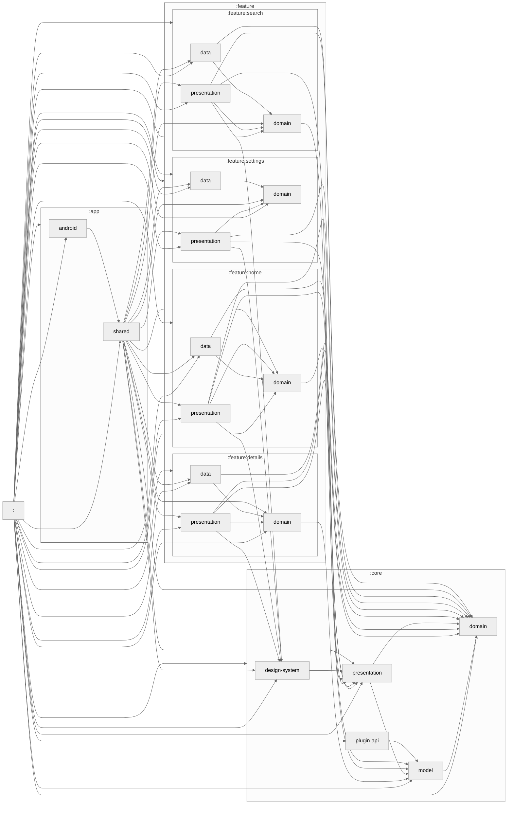

# Module Graph

This file is auto-generated by the [`dev.iurysouza.modulegraph`](https://github.com/iurysza/module-graph) Gradle plugin.

Run `./gradlew createModuleGraph` to refresh the diagram after module changes.

## Module Dependency Graph

