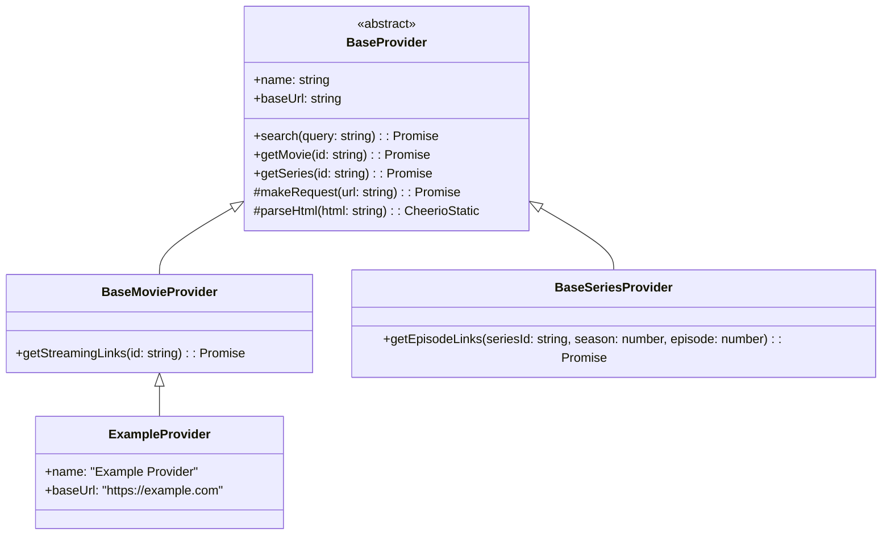

# @dreamstream/providers

<div align="center">

**Content provider implementations for DreamStream**

[](https://www.npmjs.com/package/@dreamstream/providers)
[](https://www.typescriptlang.org/)
[](https://opensource.org/licenses/MIT)

*Ethical content aggregation and streaming link discovery for movies and TV series*

</div>

---

## 📋 Table of Contents

- [🎯 Overview](#-overview)
- [⚖️ Ethical Guidelines](#️-ethical-guidelines)
- [📦 Installation](#-installation)
- [🏗️ Architecture](#️-architecture)
- [🔧 API Reference](#-api-reference)
- [📝 Usage Examples](#-usage-examples)
- [🛠️ Creating Providers](#️-creating-providers)
- [🧪 Testing](#-testing)
- [🤝 Contributing](#-contributing)

---

## 🎯 Overview

The `@dreamstream/providers` package implements a unified interface for discovering and aggregating entertainment content from various publicly available sources. It provides a clean, type-safe API for searching movies and TV series while maintaining ethical scraping practices.

### Key Features

- 🔌 **Extensible Architecture**: Plugin-based provider system
- 🔒 **Type Safety**: Full TypeScript support with comprehensive interfaces
- ⚡ **Performance**: Efficient scraping with built-in rate limiting
- 🛡️ **Error Handling**: Robust error management and retry mechanisms
- 🎯 **Unified API**: Consistent interface across all content sources
- 📊 **Data Normalization**: Standardized data formats across providers

### ⚠️ Important Disclaimer

**This package is designed for educational and research purposes only.**

- 🔍 **Content Discovery**: Aggregates publicly available information about entertainment content
- 📊 **No Content Hosting**: Does not host, store, or own any copyrighted material
- 🔗 **Third-Party Links**: All content links are sourced from external websites
- ⚖️ **User Responsibility**: Users must ensure compliance with local laws and regulations
- 🛡️ **Respect Copyright**: Always respect intellectual property rights

---

## ⚖️ Ethical Guidelines

All providers in this package **MUST** follow strict ethical guidelines:

### ✅ Required Practices

- **Respect robots.txt** files and crawling policies
- **Implement rate limiting** to prevent server overload
- **Use appropriate User-Agent** strings for identification
- **Handle errors gracefully** without retrying aggressively
- **Cache responses** to minimize redundant requests
- **Respect HTTPS/SSL** certificates and security

### ❌ Prohibited Practices

- **No content storage** - only aggregate links and metadata
- **No bypassing** of access controls or paywalls
- **No aggressive scraping** that could harm source websites
- **No copyright infringement** - aggregation only
- **No malicious activities** or abuse of source websites

### Code Example: Ethical Implementation

```typescript
// ✅ Good: Respectful rate-limited provider
export class EthicalProvider extends BaseProvider {
  private rateLimiter = new RateLimiter(10, 60000) // 10 req/min
  private cache = new Map<string, { data: any; timestamp: number }>()

  protected async makeRequest(url: string): Promise<string> {
    // Check cache first
    const cached = this.getCachedResponse(url)
    if (cached) return cached

    // Apply rate limiting
    await this.rateLimiter.wait()

    // Make respectful request
    return this.rateLimiter.execute(() =>
      super.makeRequest(url)
    )
  }
}
```

---

## 📦 Installation

```bash
# Using Bun (recommended)
bun add @dreamstream/providers

# Using npm
npm install @dreamstream/providers

# Using yarn
yarn add @dreamstream/providers
```

### Peer Dependencies

```bash
# Required peer dependencies
bun add @dreamstream/common axios cheerio
```

### Development Dependencies

```bash
# Install development dependencies
bun install
```

---

## 🏗️ Architecture

### Provider System Overview

```
@dreamstream/providers/
├── src/
│   ├── base/            # Base provider classes
│   │   ├── BaseProvider.ts
│   │   ├── BaseMovieProvider.ts
│   │   └── BaseSeriesProvider.ts
│   ├── scrapers/        # Concrete provider implementations
│   │   ├── ExampleProvider.ts
│   │   └── AnotherProvider.ts
│   ├── adapters/        # Data transformation adapters
│   │   ├── MovieAdapter.ts
│   │   └── SeriesAdapter.ts
│   ├── utils/           # Provider utilities
│   │   ├── rateLimiter.ts
│   │   ├── htmlParser.ts
│   │   ├── urlUtils.ts
│   │   └── cache.ts
│   ├── registry.ts      # Provider registry
│   └── index.ts         # Main exports
├── __tests__/          # Test files
├── package.json
└── README.md
```

### Class Hierarchy



---

## 🔧 API Reference

### Base Provider Interface

```typescript
/**
 * Abstract base provider class
 */
abstract class BaseProvider {
  /** Provider display name */
  abstract readonly name: string

  /** Provider base URL */
  abstract readonly baseUrl: string

  /**
   * Search for content
   * @param query - Search query string
   * @param filters - Optional search filters
   * @returns Promise resolving to search results
   */
  abstract search(
    query: string,
    filters?: SearchFilters
  ): Promise<SearchResult[]>

  /**
   * Get detailed movie information
   * @param id - Movie identifier
   * @returns Promise resolving to movie data or null
   */
  abstract getMovie(id: string): Promise<Movie | null>

  /**
   * Get detailed series information
   * @param id - Series identifier
   * @returns Promise resolving to series data or null
   */
  abstract getSeries(id: string): Promise<Series | null>

  /**
   * Get streaming links for content
   * @param id - Content identifier
   * @param type - Content type ('movie' or 'series')
   * @returns Promise resolving to streaming links
   */
  abstract getStreamingLinks(
    id: string,
    type: 'movie' | 'series'
  ): Promise<StreamingLink[]>
}
```

### Provider Configuration

```typescript
/**
 * Provider configuration interface
 */
interface ProviderConfig {
  /** Request timeout in milliseconds */
  readonly timeout?: number
  /** Number of retry attempts */
  readonly retries?: number
  /** Rate limit (requests per minute) */
  readonly rateLimit?: number
  /** Custom request headers */
  readonly headers?: Record<string, string>
  /** Cache duration in milliseconds */
  readonly cacheDuration?: number
}
```

### Error Handling

```typescript
/**
 * Custom provider error class
 */
class ProviderError extends Error {
  constructor(
    message: string,
    public readonly code: string,
    public readonly provider: string
  ) {
    super(message)
    this.name = 'ProviderError'
  }
}

/**
 * Network-related provider error
 */
class NetworkError extends ProviderError {
  constructor(
    message: string,
    provider: string,
    public readonly statusCode?: number
  ) {
    super(message, 'NETWORK_ERROR', provider)
    this.name = 'NetworkError'
  }
}
```

### Rate Limiting

```typescript
/**
 * Rate limiter for respectful scraping
 */
class RateLimiter {
  constructor(
    private maxRequests: number,
    private timeWindow: number
  ) {}

  /**
   * Execute function with rate limiting
   * @param fn - Function to execute
   * @returns Promise resolving to function result
   */
  async execute<T>(fn: () => Promise<T>): Promise<T>

  /**
   * Wait for available request slot
   * @returns Promise that resolves when slot is available
   */
  async wait(): Promise<void>
}
```

---

## 📝 Usage Examples

### Basic Provider Usage

```typescript
import { ExampleProvider, ProviderRegistry } from '@dreamstream/providers'

// Create provider instance
const provider = new ExampleProvider({
  timeout: 15000,
  rateLimit: 10, // 10 requests per minute
  retries: 2
})

// Search for content
const searchResults = await provider.search('The Matrix')
console.log(searchResults)

// Get movie details
const movie = await provider.getMovie('matrix-1999')
if (movie) {
  console.log(`${movie.title} (${movie.year})`)
  console.log(`Rating: ${movie.rating}/10`)
  console.log(`Duration: ${movie.duration} minutes`)
}

// Get streaming links
const links = await provider.getStreamingLinks('matrix-1999', 'movie')
links.forEach(link => {
  console.log(`${link.quality} - ${link.provider}: ${link.url}`)
})
```

### Using Provider Registry

```typescript
import { ProviderRegistry } from '@dreamstream/providers'

// Create and configure registry
const registry = new ProviderRegistry()

// Register providers
registry.register(new ExampleProvider())
registry.register(new AnotherProvider())

// Search across all providers
const allResults = await registry.searchAll('Inception', {
  type: 'movie',
  minRating: 7.0
})

// Get best results with scoring
const bestResults = registry.getBestResults(allResults, {
  preferredProviders: ['ExampleProvider'],
  maxResults: 10
})
```

### Error Handling Example

```typescript
import { ProviderError, NetworkError } from '@dreamstream/providers'

async function safeSearch(provider: BaseProvider, query: string) {
  try {
    const results = await provider.search(query)
    return { success: true, data: results }
  } catch (error) {
    if (error instanceof NetworkError) {
      console.error(`Network error from ${error.provider}:`, error.message)
      return { success: false, error: 'Network connection failed' }
    }

    if (error instanceof ProviderError) {
      console.error(`Provider error from ${error.provider}:`, error.message)
      return { success: false, error: error.message }
    }

    console.error('Unexpected error:', error)
    return { success: false, error: 'An unexpected error occurred' }
  }
}
```

### React Hook Integration

```typescript
import { useEffect, useState } from 'react'
import { BaseProvider, SearchResult } from '@dreamstream/providers'

export function useProviderSearch(
  provider: BaseProvider,
  query: string
) {
  const [results, setResults] = useState<SearchResult[]>([])
  const [loading, setLoading] = useState(false)
  const [error, setError] = useState<string | null>(null)

  useEffect(() => {
    if (!query.trim()) {
      setResults([])
      return
    }

    const searchContent = async () => {
      setLoading(true)
      setError(null)

      try {
        const searchResults = await provider.search(query)
        setResults(searchResults)
      } catch (err) {
        const errorMessage = err instanceof Error
          ? err.message
          : 'Search failed'
        setError(errorMessage)
      } finally {
        setLoading(false)
      }
    }

    // Debounce search
    const timeoutId = setTimeout(searchContent, 300)
    return () => clearTimeout(timeoutId)
  }, [provider, query])

  return { results, loading, error }
}
```

---

## 🛠️ Creating Providers

### Step 1: Implement Base Provider

```typescript
import { BaseProvider, SearchResult, Movie, StreamingLink } from '@dreamstream/providers'
import { ProviderConfig } from '@dreamstream/providers'

export class MyCustomProvider extends BaseProvider {
  readonly name = 'My Custom Provider'
  readonly baseUrl = 'https://example-movie-site.com'

  constructor(config: ProviderConfig = {}) {
    super(config)
  }

  async search(query: string): Promise<SearchResult[]> {
    const url = `${this.baseUrl}/search?q=${encodeURIComponent(query)}`
    const html = await this.makeRequest(url)
    const $ = this.parseHtml(html)

    const results: SearchResult[] = []

    $('.movie-item').each((_, element) => {
      const $el = $(element)
      const id = $el.data('id')
      const title = $el.find('.title').text().trim()
      const year = parseInt($el.find('.year').text()) || 0
      const poster = $el.find('img').attr('src')

      if (id && title) {
        results.push({
          id: String(id),
          title,
          year,
          type: 'movie', // or determine from data
          poster: poster || null
        })
      }
    })

    return results
  }

  async getMovie(id: string): Promise<Movie | null> {
    const url = `${this.baseUrl}/movie/${id}`

    try {
      const html = await this.makeRequest(url)
      const $ = this.parseHtml(html)

      // Extract movie data
      const title = $('.movie-title').text().trim()
      const year = parseInt($('.movie-year').text()) || 0
      const duration = parseInt($('.duration').text()) || 0
      const rating = parseFloat($('.rating').text()) || 0
      const overview = $('.overview').text().trim()

      if (!title) return null

      return {
        id,
        title,
        year,
        duration,
        rating,
        overview,
        genre: this.extractGenres($),
        poster: $('.poster img').attr('src') || null,
        backdrop: $('.backdrop img').attr('src') || null,
        releaseDate: this.extractReleaseDate($),
        status: 'released'
      }
    } catch (error) {
      console.error(`Failed to get movie ${id}:`, error)
      return null
    }
  }

  async getSeries(id: string): Promise<Series | null> {
    // Similar implementation for series
    // ...
    return null
  }

  async getStreamingLinks(id: string, type: 'movie' | 'series'): Promise<StreamingLink[]> {
    const url = `${this.baseUrl}/${type}/${id}/watch`

    try {
      const html = await this.makeRequest(url)
      const $ = this.parseHtml(html)

      const links: StreamingLink[] = []

      $('.streaming-link').each((_, element) => {
        const $el = $(element)
        const linkUrl = $el.attr('href')
        const quality = $el.data('quality') || 'unknown'
        const format = $el.data('format') || 'unknown'

        if (linkUrl) {
          links.push({
            url: linkUrl,
            quality: quality as any,
            format: format as any,
            type: 'direct',
            provider: this.name,
            reliability: 0.8 // Based on provider reliability
          })
        }
      })

      return links
    } catch (error) {
      console.error(`Failed to get streaming links for ${id}:`, error)
      return []
    }
  }

  private extractGenres($: CheerioStatic): string[] {
    return $('.genre-tag').map((_, el) => $(el).text().trim()).get()
  }

  private extractReleaseDate($: CheerioStatic): string {
    const dateText = $('.release-date').text()
    return new Date(dateText).toISOString()
  }
}
```

### Step 2: Add Rate Limiting and Caching

```typescript
export class MyCustomProvider extends BaseProvider {
  private rateLimiter: RateLimiter
  private cache = new Map<string, { data: any; timestamp: number }>()

  constructor(config: ProviderConfig = {}) {
    super(config)
    this.rateLimiter = new RateLimiter(
      config.rateLimit || 10, // 10 requests per minute by default
      60000 // 1 minute window
    )
  }

  protected async makeRequest(url: string): Promise<string> {
    // Check cache first
    const cacheKey = url
    const cached = this.cache.get(cacheKey)
    const cacheAge = Date.now() - (cached?.timestamp || 0)

    if (cached && cacheAge < (this.config.cacheDuration || 300000)) {
      return cached.data
    }

    // Apply rate limiting
    const response = await this.rateLimiter.execute(() =>
      super.makeRequest(url)
    )

    // Cache the response
    this.cache.set(cacheKey, {
      data: response,
      timestamp: Date.now()
    })

    return response
  }
}
```

### Step 3: Add to Registry

```typescript
// Register your provider
import { ProviderRegistry } from '@dreamstream/providers'
import { MyCustomProvider } from './MyCustomProvider'

const registry = new ProviderRegistry()
registry.register(new MyCustomProvider({
  timeout: 15000,
  rateLimit: 10,
  retries: 2
}))

export { registry as defaultRegistry }
```

---

## 🧪 Testing

### Running Tests

```bash
# Run all tests
bun test

# Run tests in watch mode
bun test --watch

# Run tests with coverage
bun test --coverage

# Run specific test file
bun test MyCustomProvider.test.ts
```

### Test Examples

#### Provider Unit Tests

```typescript
// __tests__/MyCustomProvider.test.ts
import { MyCustomProvider } from '../src/scrapers/MyCustomProvider'

describe('MyCustomProvider', () => {
  let provider: MyCustomProvider

  beforeEach(() => {
    provider = new MyCustomProvider({
      timeout: 5000,
      rateLimit: 100 // Higher limit for testing
    })
  })

  describe('search', () => {
    it('should return search results', async () => {
      const results = await provider.search('The Matrix')

      expect(results).toBeInstanceOf(Array)
      expect(results.length).toBeGreaterThan(0)

      results.forEach(result => {
        expect(result).toMatchObject({
          id: expect.any(String),
          title: expect.any(String),
          year: expect.any(Number),
          type: expect.stringMatching(/^(movie|series)$/),
          poster: expect.any(String)
        })
      })
    })

    it('should handle empty search results', async () => {
      const results = await provider.search('nonexistentmovie123456')
      expect(results).toEqual([])
    })
  })

  describe('getMovie', () => {
    it('should return movie details', async () => {
      const movie = await provider.getMovie('matrix-1999')

      if (movie) {
        expect(movie).toMatchObject({
          id: 'matrix-1999',
          title: expect.any(String),
          year: expect.any(Number),
          duration: expect.any(Number),
          rating: expect.any(Number)
        })
      }
    })

    it('should return null for non-existent movie', async () => {
      const movie = await provider.getMovie('nonexistent-movie')
      expect(movie).toBeNull()
    })
  })
})
```

#### Rate Limiter Tests

```typescript
// __tests__/rateLimiter.test.ts
import { RateLimiter } from '../src/utils/rateLimiter'

describe('RateLimiter', () => {
  it('should limit request rate', async () => {
    const limiter = new RateLimiter(2, 1000) // 2 requests per second
    const startTime = Date.now()

    // Execute 3 requests
    const promises = Array(3).fill(null).map((_, i) =>
      limiter.execute(async () => `request-${i}`)
    )

    const results = await Promise.all(promises)
    const endTime = Date.now()

    expect(results).toEqual(['request-0', 'request-1', 'request-2'])
    expect(endTime - startTime).toBeGreaterThan(500) // Should take at least 500ms
  })
})
```

#### Integration Tests

```typescript
// __tests__/integration/provider.integration.test.ts
import { MyCustomProvider } from '../src/scrapers/MyCustomProvider'

describe('MyCustomProvider Integration', () => {
  let provider: MyCustomProvider

  beforeAll(() => {
    provider = new MyCustomProvider()
  })

  it('should complete full movie workflow', async () => {
    // Search for movie
    const searchResults = await provider.search('Inception')
    expect(searchResults.length).toBeGreaterThan(0)

    // Get movie details
    const movieId = searchResults[0].id
    const movie = await provider.getMovie(movieId)
    expect(movie).toBeTruthy()

    // Get streaming links
    if (movie) {
      const links = await provider.getStreamingLinks(movie.id, 'movie')
      expect(links).toBeInstanceOf(Array)
      // Note: Don't expect links to always be available
    }
  }, 30000) // 30 second timeout for integration tests
})
```

---

## 🤝 Contributing

We welcome contributions to the providers package! Please see our [Contributing Guide](../../CONTRIBUTING.md) for details.

### Development Guidelines

#### Before Creating a Provider

1. **Research the Source**: Ensure the website allows programmatic access
2. **Check robots.txt**: Respect crawling policies
3. **Review Terms of Service**: Ensure compliance with website terms
4. **Plan Rate Limits**: Determine appropriate request frequency

#### Provider Development Checklist

- [ ] Extends `BaseProvider` correctly
- [ ] Implements all required methods
- [ ] Includes proper error handling
- [ ] Respects rate limiting
- [ ] Uses appropriate caching
- [ ] Follows ethical guidelines
- [ ] Has comprehensive tests
- [ ] Includes JSDoc documentation

#### Code Review Criteria

- **Functionality**: Does it work as expected?
- **Ethics**: Does it follow our ethical guidelines?
- **Performance**: Is it efficient and respectful?
- **Error Handling**: Are errors handled gracefully?
- **Tests**: Are there adequate tests?
- **Documentation**: Is it well documented?

### Submitting a New Provider

1. **Create Provider Class**: Implement all required methods
2. **Add Tests**: Write comprehensive unit and integration tests
3. **Update Registry**: Add to the default provider registry
4. **Document Usage**: Add examples to this README
5. **Submit PR**: Create a pull request with detailed description

---

<div align="center">

**⚠️ Remember: This package is for educational purposes only**

*Always respect copyright laws and website terms of service*

[Documentation](../../docs/) • [Contributing](../../CONTRIBUTING.md) • [License](../../LICENSE)

**Made with ❤️ by the DreamStream team**

</div>
